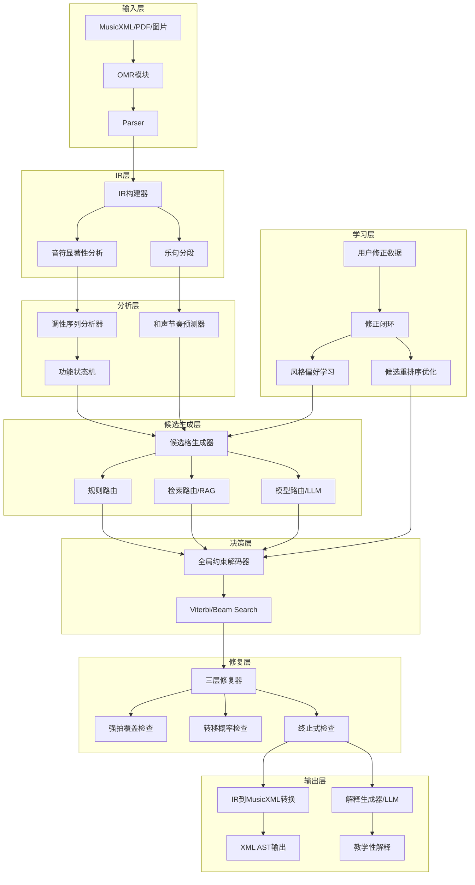

# 设计文档：MeloChord 和声引擎架构升级

## 概述

### 项目背景

MeloChord 是一个自动和声分析引擎，当前架构基于 MusicXML/OMR → IR → 调性分析 → RAG 检索 → LLM 生成 → 验证 → 输出的流程。本次升级旨在将系统从"能演示的研究型原型"升级为"优秀卓越、十分可用"的产品级和声分析引擎。

### 核心架构转变

本次升级的核心是从"LLM 主导决策"转向"约束搜索 + LLM 辅助"的架构：

**当前架构问题**：
- LLM 直接生成和弦序列，导致输出不稳定、难以控制
- 固定分块处理（如每 8 小节），忽略音乐结构边界
- 验证器只能检测错误，无法修复
- 调性分析为单次判断，无法处理转调序列
- RAG 检索基于旋律相似度，缺乏和声语义理解

**新架构优势**：
- 候选格 + 全局解码器确保输出可控、可解释
- 和声节奏独立建模，尊重音乐结构
- 修复器主动纠错，提高输出质量
- 序列化调性建模，准确处理转调
- 和声语义检索，提供更相关的参考案例

### 产品定位升级

从"自动配和弦工具"重新定位为**"AI 和声副驾 + 乐谱工作台 + 教学协作工具"**，围绕五大护城河：

1. **教学护城河**：提供功能解释、替代方案、难度分级、错误诊断
2. **编辑护城河**：支持局部改写、全局联动、重复乐句一致性
3. **数据护城河**：用户修正数据持续反哺模型优化
4. **评测护城河**：系统性了解易错场景、受欢迎风格、可接受难度
5. **机构护城河**：学校、工作室、教培机构的谱面、作业、修正轨迹沉淀

### 设计目标

1. **稳定性**：和弦序列输出稳定、可预测、可控制
2. **音乐性**：尊重音乐结构、功能和声规则、风格特征
3. **可解释性**：每个和声决策都有明确理由，支持教学场景
4. **可编辑性**：支持非线性工作流、局部修正、版本管理
5. **可扩展性**：支持多风格、多难度、用户偏好学习
6. **性能**：控制 API 成本、提高响应速度、支持离线降级

---

## 架构设计

### 系统架构图



### 数据流

1. **输入处理**：MusicXML/PDF/图片 → OMR → Parser → IR
2. **结构分析**：IR → 音符显著性 + 乐句分段 + 和声节奏预测
3. **调性分析**：旋律序列 → 调性序列分析器 → 功能状态机
4. **候选生成**：调性 + 和声节奏 → 候选格（规则 + 检索 + 模型）
5. **全局决策**：候选格 → 全局解码器 → 最优和弦序列
6. **修复验证**：和弦序列 → 三层修复器 → 修正后序列
7. **输出生成**：修正后序列 → MusicXML + 解释文本
8. **学习反馈**：用户修正 → 修正闭环 → 优化候选生成

### 模块职责

| 模块 | 职责 | 输入 | 输出 |
|------|------|------|------|
| OMR模块 | 光学音乐识别，提供置信度 | PDF/图片 | MusicXML + 置信度 |
| Parser | 解析音乐结构，处理复杂记谱 | MusicXML | IR |
| IR构建器 | 构建内部表示，双层和声表示 | 解析后的音乐数据 | IR对象 |
| 音符显著性分析 | 计算每个音符的音乐重要性 | IR | 带显著性标注的IR |
| 乐句分段 | 识别音乐意义上的乐句边界 | IR | 乐句边界列表 |
| 和声节奏预测器 | 预测和弦变化的时间位置 | IR + 难度级别 | 时间跨度列表 |
| 调性序列分析器 | 序列化建模局部调性 | 旋律序列 | 调性序列 + 置信度 |
| 功能状态机 | 追踪当前和声功能区域 | 调性 + 上下文 | 功能状态 |
| 候选格生成器 | 生成结构化候选空间 | 调性 + 和声节奏 + 旋律 | 候选格 |
| 规则路由 | 基于理论规则生成候选 | 调性 + 功能状态 | 候选和弦集合 |
| 检索路由 | 基于相似片段生成候选 | 旋律特征 | 候选和弦集合 |
| 模型路由 | 基于LLM/符号模型生成候选 | 上下文 | 候选和弦集合 |
| 全局约束解码器 | 求解全局最优和弦序列 | 候选格 | 和弦序列 + 置信度 |
| 三层修复器 | 检测并修复和声问题 | 和弦序列 | 修正后序列 |
| MusicXML输出 | 结构化输出和声标注 | IR + 和弦序列 | MusicXML |
| 解释生成器 | 生成教学性解释 | 和弦序列 + 上下文 | 解释文本 |
| 修正闭环 | 收集并学习用户修正 | 用户修正数据 | 优化参数 |

---

## 组件和接口

### 1. 候选和弦格生成系统

#### 1.1 候选格数据结构

```python
@dataclass
class ChordCandidate:
    """单个候选和弦"""
    # 表层表示
    root: str  # 根音，如 "C", "D"
    quality: str  # 和弦类型，如 "major", "minor", "dominant7"
    inversion: int  # 转位，0=原位，1=第一转位，2=第二转位
    bass: Optional[str]  # 斜线和弦的低音
    extensions: List[str]  # 延伸音，如 ["9", "11"]
    alterations: List[Tuple[str, int]]  # 变化音，如 [("5", -1)] 表示降5音
    
    # 功能层表示
    local_key: str  # 局部调性，如 "C major"
    roman_numeral: str  # 罗马数字，如 "I", "V7", "ii"
    function: str  # 功能角色，如 "tonic", "dominant", "subdominant"
    cadence_role: Optional[str]  # 终止式角色，如 "authentic_cadence_V"
    
    # 元数据
    confidence: float  # 置信度，0-1
    difficulty: str  # 难度级别，"basic", "intermediate", "advanced"
    source: str  # 来源，"rule", "retrieval", "model"
    explanation: str  # 简短解释
    
    # 评分组件
    melody_coverage: float  # 旋律覆盖度
    beat_alignment: float  # 强拍对齐度
    function_fit: float  # 功能匹配度
    style_fit: float  # 风格匹配度


@dataclass
class CandidateLattice:
    """候选格：时间跨度 → 候选和弦集合"""
    time_spans: List[Tuple[float, float]]  # [(start_time, end_time), ...]
    candidates: List[List[ChordCandidate]]  # 每个时间跨度的候选集合
    transition_scores: Dict[Tuple[int, int, int, int], float]  # (span_i, cand_j, span_k, cand_l) → score
    
    def get_candidates(self, span_index: int) -> List[ChordCandidate]:
        """获取指定时间跨度的候选"""
        return self.candidates[span_index]
    
    def get_transition_score(self, from_span: int, from_cand: int, 
                            to_span: int, to_cand: int) -> float:
        """获取两个候选之间的转移得分"""
        return self.transition_scores.get((from_span, from_cand, to_span, to_cand), 0.0)
```

#### 1.2 候选格生成器接口

```python
class CandidateLatticeGenerator:
    """候选格生成器"""
    
    def __init__(self, 
                 rule_router: RuleRouter,
                 retrieval_router: RetrievalRouter,
                 model_router: ModelRouter,
                 difficulty_controller: DifficultyController):
        self.rule_router = rule_router
        self.retrieval_router = retrieval_router
        self.model_router = model_router
        self.difficulty_controller = difficulty_controller
    
    def generate(self, 
                 ir: IR,
                 time_spans: List[Tuple[float, float]],
                 key_sequence: List[KeyInfo],
                 difficulty: str,
                 style: str) -> CandidateLattice:
        """
        生成候选格
        
        Args:
            ir: 中间表示
            time_spans: 和声节奏预测的时间跨度
            key_sequence: 调性序列
            difficulty: 难度级别
            style: 风格配置
            
        Returns:
            候选格
        """
        lattice = CandidateLattice(time_spans=time_spans, candidates=[], transition_scores={})
        
        for span_idx, (start, end) in enumerate(time_spans):
            # 获取该时间跨度的上下文
            context = self._extract_context(ir, start, end, span_idx, time_spans)
            key_info = key_sequence[span_idx]
            
            # 从三个路由生成候选
            rule_candidates = self.rule_router.generate(context, key_info, difficulty, style)
            retrieval_candidates = self.retrieval_router.generate(context, key_info, style)
            model_candidates = self.model_router.generate(context, key_info, difficulty, style)
            
            # 合并并去重
            all_candidates = self._merge_and_deduplicate(
                rule_candidates, retrieval_candidates, model_candidates
            )
            
            # 应用难度过滤
            filtered_candidates = self.difficulty_controller.filter(all_candidates, difficulty)
            
            lattice.candidates.append(filtered_candidates)
        
        # 计算转移得分
        lattice.transition_scores = self._compute_transition_scores(lattice, ir, key_sequence)
        
        return lattice
```


#### 1.3 规则路由

```python
class RuleRouter:
    """基于理论规则生成候选"""
    
    def generate(self, context: Context, key_info: KeyInfo, 
                 difficulty: str, style: str) -> List[ChordCandidate]:
        """
        基于功能和声理论生成候选
        
        策略：
        1. 根据功能状态确定可能的功能角色（T/S/D）
        2. 根据强拍音确定可能的和弦根音
        3. 根据终止式位置提高特定候选权重
        4. 根据难度级别限制和弦类型
        """
        candidates = []
        
        # 获取功能状态
        function_state = context.function_state
        
        # 根据功能状态生成候选
        if function_state == "tonic":
            candidates.extend(self._generate_tonic_chords(key_info, difficulty))
        elif function_state == "subdominant":
            candidates.extend(self._generate_subdominant_chords(key_info, difficulty))
        elif function_state == "dominant":
            candidates.extend(self._generate_dominant_chords(key_info, difficulty))
        elif function_state == "cadence":
            candidates.extend(self._generate_cadence_chords(key_info, context, difficulty))
        
        # 根据强拍音过滤
        candidates = self._filter_by_melody(candidates, context.strong_beat_notes)
        
        # 添加元数据
        for cand in candidates:
            cand.source = "rule"
            cand.explanation = self._generate_rule_explanation(cand, context)
        
        return candidates
```

#### 1.4 检索路由（RAG）

```python
class RetrievalRouter:
    """基于相似片段检索生成候选"""
    
    def __init__(self, rag_module: RAGModule):
        self.rag_module = rag_module
    
    def generate(self, context: Context, key_info: KeyInfo, 
                 style: str) -> List[ChordCandidate]:
        """
        基于和声语义相似检索生成候选
        
        策略：
        1. 提取重拍骨干音序列
        2. 提取句法位置标签
        3. 提取旋律稳定度特征
        4. 提取节奏-和声耦合特征
        5. 混合检索（符号 + 密集向量）
        6. 从检索结果中提取候选统计
        """
        # 提取特征
        features = self._extract_features(context)
        
        # 混合检索
        similar_segments = self.rag_module.hybrid_search(
            features=features,
            key=key_info.key,
            mode=key_info.mode,
            style=style,
            top_k=10
        )
        
        # 从检索结果中提取候选
        candidates = self._extract_candidates_from_retrieval(
            similar_segments, key_info, context
        )
        
        # 添加元数据
        for cand in candidates:
            cand.source = "retrieval"
            cand.explanation = f"常见于相似片段（{cand.confidence:.0%}出现率）"
        
        return candidates
    
    def _extract_features(self, context: Context) -> Dict:
        """提取和声语义特征"""
        return {
            "backbone_notes": self._extract_backbone_notes(context),
            "phrase_position": context.phrase_position,
            "stability": self._compute_stability(context),
            "rhythm_harmony_coupling": self._compute_coupling(context),
            "cadence_pattern": context.cadence_pattern
        }
```

#### 1.5 模型路由

```python
class ModelRouter:
    """基于LLM/符号模型生成候选"""
    
    def __init__(self, llm_client: LLMClient, symbolic_model: Optional[SymbolicModel] = None):
        self.llm_client = llm_client
        self.symbolic_model = symbolic_model
    
    def generate(self, context: Context, key_info: KeyInfo, 
                 difficulty: str, style: str) -> List[ChordCandidate]:
        """
        基于模型生成候选（优先使用本地符号模型，低置信时调用LLM）
        
        策略：
        1. 优先使用本地小型符号模型
        2. 仅在低置信区域或边界难例调用LLM
        3. LLM提供top-N补充候选，而非直接决策
        """
        candidates = []
        
        # 优先使用本地符号模型
        if self.symbolic_model is not None:
            symbolic_candidates = self.symbolic_model.predict(
                context=context,
                key_info=key_info,
                difficulty=difficulty,
                style=style,
                top_k=5
            )
            candidates.extend(symbolic_candidates)
        
        # 如果置信度低或是边界难例，调用LLM补充
        if self._is_low_confidence(context) or self._is_edge_case(context):
            llm_candidates = self._query_llm(context, key_info, difficulty, style)
            candidates.extend(llm_candidates)
        
        # 添加元数据
        for cand in candidates:
            cand.source = "model"
        
        return candidates
    
    def _query_llm(self, context: Context, key_info: KeyInfo, 
                   difficulty: str, style: str) -> List[ChordCandidate]:
        """调用LLM生成候选"""
        prompt = self._build_prompt(context, key_info, difficulty, style)
        response = self.llm_client.complete(prompt)
        return self._parse_llm_response(response, key_info)
```

### 2. 全局约束解码器

#### 2.1 解码器接口

```python
class GlobalDecoder:
    """全局约束解码器"""
    
    def __init__(self, algorithm: str = "viterbi"):
        """
        Args:
            algorithm: 解码算法，"viterbi" 或 "beam_search"
        """
        self.algorithm = algorithm
    
    def decode(self, lattice: CandidateLattice, ir: IR, 
               key_sequence: List[KeyInfo]) -> Tuple[List[ChordCandidate], float]:
        """
        从候选格中解码全局最优和弦序列
        
        Args:
            lattice: 候选格
            ir: 中间表示
            key_sequence: 调性序列
            
        Returns:
            (最优和弦序列, 总得分)
        """
        if self.algorithm == "viterbi":
            return self._viterbi_decode(lattice, ir, key_sequence)
        elif self.algorithm == "beam_search":
            return self._beam_search_decode(lattice, ir, key_sequence)
        else:
            raise ValueError(f"Unknown algorithm: {self.algorithm}")
    
    def _viterbi_decode(self, lattice: CandidateLattice, ir: IR, 
                        key_sequence: List[KeyInfo]) -> Tuple[List[ChordCandidate], float]:
        """
        Viterbi算法：动态规划求解全局最优路径
        
        状态：(时间跨度索引, 候选和弦索引)
        转移：从一个时间跨度的候选到下一个时间跨度的候选
        得分：局部得分 + 转移得分
        """
        n_spans = len(lattice.time_spans)
        
        # 初始化DP表
        # dp[span_idx][cand_idx] = (最优得分, 回溯指针)
        dp = [[(-float('inf'), -1) for _ in lattice.candidates[i]] 
              for i in range(n_spans)]
        
        # 初始化第一个时间跨度
        for cand_idx, cand in enumerate(lattice.candidates[0]):
            local_score = self._compute_local_score(cand, lattice.time_spans[0], ir, key_sequence[0])
            dp[0][cand_idx] = (local_score, -1)
        
        # 动态规划
        for span_idx in range(1, n_spans):
            for curr_cand_idx, curr_cand in enumerate(lattice.candidates[span_idx]):
                # 计算局部得分
                local_score = self._compute_local_score(
                    curr_cand, lattice.time_spans[span_idx], ir, key_sequence[span_idx]
                )
                
                # 找到最优前驱
                best_score = -float('inf')
                best_prev = -1
                
                for prev_cand_idx in range(len(lattice.candidates[span_idx - 1])):
                    # 前驱得分
                    prev_score = dp[span_idx - 1][prev_cand_idx][0]
                    
                    # 转移得分
                    transition_score = lattice.get_transition_score(
                        span_idx - 1, prev_cand_idx, span_idx, curr_cand_idx
                    )
                    
                    # 总得分
                    total_score = prev_score + transition_score + local_score
                    
                    if total_score > best_score:
                        best_score = total_score
                        best_prev = prev_cand_idx
                
                dp[span_idx][curr_cand_idx] = (best_score, best_prev)
        
        # 回溯最优路径
        path = []
        best_final_idx = max(range(len(dp[-1])), key=lambda i: dp[-1][i][0])
        best_score = dp[-1][best_final_idx][0]
        
        curr_idx = best_final_idx
        for span_idx in range(n_spans - 1, -1, -1):
            path.append(lattice.candidates[span_idx][curr_idx])
            curr_idx = dp[span_idx][curr_idx][1]
        
        path.reverse()
        return path, best_score
```


#### 2.2 评分函数

```python
def _compute_local_score(self, cand: ChordCandidate, time_span: Tuple[float, float],
                         ir: IR, key_info: KeyInfo) -> float:
    """
    计算局部得分（单个和弦在当前位置的适配度）
    
    组成部分：
    1. 旋律-和弦匹配度：强拍音是否在和弦内
    2. 调性匹配度：和弦是否属于当前调性
    3. 强拍覆盖度：和弦音覆盖强拍旋律音的比例
    4. 难度匹配度：和弦难度是否符合目标难度
    5. 置信度：候选自身的置信度
    """
    score = 0.0
    
    # 1. 旋律-和弦匹配度（权重：0.4）
    melody_notes = ir.get_notes_in_span(time_span)
    strong_beat_notes = [n for n in melody_notes if n.is_strong_beat]
    chord_tones = self._get_chord_tones(cand)
    
    coverage = sum(1 for n in strong_beat_notes if n.pitch_class in chord_tones) / len(strong_beat_notes)
    score += 0.4 * coverage
    
    # 2. 调性匹配度（权重：0.2）
    if cand.local_key == key_info.key:
        score += 0.2
    elif self._is_related_key(cand.local_key, key_info.key):
        score += 0.1
    
    # 3. 强拍覆盖度（权重：0.2）
    score += 0.2 * cand.melody_coverage
    
    # 4. 难度匹配度（权重：0.1）
    if cand.difficulty == self.target_difficulty:
        score += 0.1
    
    # 5. 置信度（权重：0.1）
    score += 0.1 * cand.confidence
    
    return score


def _compute_transition_score(self, from_cand: ChordCandidate, to_cand: ChordCandidate,
                               ir: IR, key_sequence: List[KeyInfo]) -> float:
    """
    计算转移得分（两个和弦之间的连接合理性）
    
    组成部分：
    1. 功能推进合理性：T→S→D→T 的功能进行
    2. 终止式倾向：句尾位置的终止式模式
    3. 低音线平滑性：低音音程跳动
    4. 历史转移概率：从数据中学习的转移概率
    5. 调性连续性：是否发生转调
    """
    score = 0.0
    
    # 1. 功能推进合理性（权重：0.3）
    function_score = self._evaluate_function_progression(from_cand.function, to_cand.function)
    score += 0.3 * function_score
    
    # 2. 终止式倾向（权重：0.2）
    if to_cand.cadence_role is not None:
        cadence_score = self._evaluate_cadence(from_cand, to_cand)
        score += 0.2 * cadence_score
    
    # 3. 低音线平滑性（权重：0.2）
    bass_interval = self._compute_bass_interval(from_cand, to_cand)
    smoothness = 1.0 / (1.0 + abs(bass_interval) / 12.0)  # 音程越小越平滑
    score += 0.2 * smoothness
    
    # 4. 历史转移概率（权重：0.2）
    transition_prob = self.transition_matrix.get((from_cand.roman_numeral, to_cand.roman_numeral), 0.0)
    score += 0.2 * transition_prob
    
    # 5. 调性连续性（权重：0.1）
    if from_cand.local_key == to_cand.local_key:
        score += 0.1
    elif self._is_smooth_modulation(from_cand.local_key, to_cand.local_key):
        score += 0.05
    
    return score
```

### 3. 和声节奏预测器

#### 3.1 和声节奏预测器接口

```python
class HarmonicRhythmPredictor:
    """和声节奏预测器：预测和弦变化的时间位置"""
    
    def predict(self, ir: IR, difficulty: str, style: str) -> List[Tuple[float, float]]:
        """
        预测和声节奏（和弦变化的时间跨度）
        
        考虑因素：
        1. 强拍位置（小节线、强拍）
        2. 长时值音（全音符、二分音符）
        3. 休止符（乐句边界）
        4. 乐句边界（从乐句分段模块获取）
        5. 难度级别（basic倾向稀疏，advanced允许密集）
        
        Args:
            ir: 中间表示
            difficulty: 难度级别
            style: 风格配置
            
        Returns:
            时间跨度列表 [(start_time, end_time), ...]
        """
        time_spans = []
        
        # 获取乐句边界
        phrase_boundaries = ir.phrase_boundaries
        
        # 根据难度确定基础和声节奏密度
        if difficulty == "basic":
            base_duration = 4.0  # 一小节一和弦（假设4/4拍）
        elif difficulty == "intermediate":
            base_duration = 2.0  # 两拍一和弦
        else:  # advanced
            base_duration = 1.0  # 一拍一和弦
        
        current_time = 0.0
        for phrase_start, phrase_end in phrase_boundaries:
            # 在乐句内部预测和声节奏
            phrase_spans = self._predict_phrase_rhythm(
                ir, phrase_start, phrase_end, base_duration, style
            )
            time_spans.extend(phrase_spans)
            current_time = phrase_end
        
        return time_spans
    
    def _predict_phrase_rhythm(self, ir: IR, start: float, end: float,
                               base_duration: float, style: str) -> List[Tuple[float, float]]:
        """在单个乐句内预测和声节奏"""
        spans = []
        current = start
        
        while current < end:
            # 查找下一个和弦变化点
            next_change = self._find_next_change_point(
                ir, current, end, base_duration, style
            )
            
            if next_change > current:
                spans.append((current, next_change))
                current = next_change
            else:
                # 如果找不到合适的变化点，使用基础时长
                next_change = min(current + base_duration, end)
                spans.append((current, next_change))
                current = next_change
        
        return spans
    
    def _find_next_change_point(self, ir: IR, current: float, end: float,
                                base_duration: float, style: str) -> float:
        """
        查找下一个和弦变化点
        
        优先级：
        1. 乐句边界（最高优先级）
        2. 强拍位置 + 长时值音
        3. 休止符后
        4. 基础时长
        """
        # 候选变化点
        candidates = []
        
        # 1. 检查是否有乐句边界
        for boundary in ir.phrase_boundaries:
            if current < boundary <= end:
                candidates.append((boundary, 1.0))  # (时间, 权重)
        
        # 2. 检查强拍 + 长时值音
        for note in ir.get_notes_in_span((current, end)):
            if note.is_strong_beat and note.duration >= 2.0:
                candidates.append((note.start_time, 0.8))
        
        # 3. 检查休止符后
        for rest in ir.get_rests_in_span((current, end)):
            candidates.append((rest.end_time, 0.7))
        
        # 4. 基础时长
        candidates.append((current + base_duration, 0.5))
        
        # 选择权重最高且最接近基础时长的候选
        if not candidates:
            return current + base_duration
        
        # 过滤掉太近的候选（至少间隔半拍）
        candidates = [(t, w) for t, w in candidates if t - current >= 0.5]
        
        if not candidates:
            return current + base_duration
        
        # 选择权重最高的
        best_candidate = max(candidates, key=lambda x: x[1])
        return best_candidate[0]
```

### 4. 调性序列分析器

#### 4.1 调性序列分析器接口

```python
@dataclass
class KeyInfo:
    """调性信息"""
    key: str  # 调性，如 "C", "D"
    mode: str  # 调式，如 "major", "minor", "mixolydian"
    confidence: float  # 置信度
    start_time: float  # 起始时间
    end_time: float  # 结束时间


class KeySequenceAnalyzer:
    """调性序列分析器：使用序列模型建模局部调性"""
    
    def __init__(self):
        self.key_inertia = 0.8  # 调性惯性
        self.modulation_penalty = 0.3  # 转调惩罚
    
    def analyze(self, ir: IR) -> List[KeyInfo]:
        """
        分析调性序列
        
        使用HMM或Viterbi算法建模调性序列：
        - 状态：24个大小调 + 其他调式
        - 观测：旋律音级分布、隐含和声、终止式线索
        - 转移：调性惯性 + 转调惩罚
        
        Args:
            ir: 中间表示
            
        Returns:
            调性序列
        """
        # 将旋律分成小窗口（如每2小节）
        windows = self._create_windows(ir, window_size=8.0)  # 8拍 = 2小节（4/4拍）
        
        # 为每个窗口计算所有可能调性的得分
        key_scores = []
        for window in windows:
            scores = self._compute_key_scores(ir, window)
            key_scores.append(scores)
        
        # 使用Viterbi算法求解最优调性序列
        key_sequence = self._viterbi_key_sequence(key_scores, windows)
        
        return key_sequence
    
    def _compute_key_scores(self, ir: IR, window: Tuple[float, float]) -> Dict[str, float]:
        """
        计算窗口内所有可能调性的得分
        
        特征：
        1. 音级分布（Krumhansl-Schmuckler算法）
        2. 隐含和声（强拍音暗示的和弦）
        3. 终止式线索（句尾的V-I进行）
        4. 临时记号（升降号暗示转调）
        """
        scores = {}
        notes = ir.get_notes_in_span(window)
        
        # 1. 音级分布
        pitch_class_counts = self._count_pitch_classes(notes)
        for key_mode in self._all_keys():
            profile = self._get_key_profile(key_mode)
            correlation = self._correlate(pitch_class_counts, profile)
            scores[key_mode] = correlation
        
        # 2. 隐含和声
        strong_beat_notes = [n for n in notes if n.is_strong_beat]
        for key_mode in self._all_keys():
            harmony_fit = self._evaluate_harmony_fit(strong_beat_notes, key_mode)
            scores[key_mode] += 0.3 * harmony_fit
        
        # 3. 终止式线索
        if self._is_phrase_end(window, ir):
            for key_mode in self._all_keys():
                cadence_fit = self._evaluate_cadence_fit(notes, key_mode)
                scores[key_mode] += 0.2 * cadence_fit
        
        return scores
```


    def _viterbi_key_sequence(self, key_scores: List[Dict[str, float]], 
                             windows: List[Tuple[float, float]]) -> List[KeyInfo]:
        """
        使用Viterbi算法求解最优调性序列
        
        状态转移：
        - 保持同一调性：得分 × key_inertia
        - 转到相关调性（属调、下属调、关系大小调）：得分 × (1 - modulation_penalty/2)
        - 转到远关系调性：得分 × (1 - modulation_penalty)
        """
        n_windows = len(windows)
        all_keys = list(key_scores[0].keys())
        
        # DP表：dp[window_idx][key] = (最优得分, 回溯指针)
        dp = [{} for _ in range(n_windows)]
        
        # 初始化
        for key in all_keys:
            dp[0][key] = (key_scores[0][key], None)
        
        # 动态规划
        for i in range(1, n_windows):
            for curr_key in all_keys:
                best_score = -float('inf')
                best_prev = None
                
                for prev_key in all_keys:
                    prev_score = dp[i-1][prev_key][0]
                    
                    # 转移得分
                    if curr_key == prev_key:
                        transition = self.key_inertia
                    elif self._is_related_key(curr_key, prev_key):
                        transition = 1.0 - self.modulation_penalty / 2
                    else:
                        transition = 1.0 - self.modulation_penalty
                    
                    total_score = prev_score + key_scores[i][curr_key] * transition
                    
                    if total_score > best_score:
                        best_score = total_score
                        best_prev = prev_key
                
                dp[i][curr_key] = (best_score, best_prev)
        
        # 回溯
        best_final_key = max(dp[-1].keys(), key=lambda k: dp[-1][k][0])
        path = [best_final_key]
        
        for i in range(n_windows - 1, 0, -1):
            prev_key = dp[i][path[0]][1]
            path.insert(0, prev_key)
        
        # 转换为KeyInfo列表
        key_sequence = []
        for i, key_mode in enumerate(path):
            key, mode = key_mode.split()
            key_sequence.append(KeyInfo(
                key=key,
                mode=mode,
                confidence=dp[i][key_mode][0],
                start_time=windows[i][0],
                end_time=windows[i][1]
            ))
        
        return key_sequence


### 5. 三层修复器

#### 5.1 修复器接口

```python
class ThreeLayerRepairer:
    """三层修复器：检测并修复和声问题"""
    
    def repair(self, chord_sequence: List[ChordCandidate], ir: IR, 
               lattice: CandidateLattice) -> List[ChordCandidate]:
        """
        三层纠错机制
        
        Layer 1: 强拍覆盖检查
        Layer 2: 转移概率检查
        Layer 3: 终止式检查
        
        Args:
            chord_sequence: 初始和弦序列
            ir: 中间表示
            lattice: 候选格（用于查找替代方案）
            
        Returns:
            修复后的和弦序列
        """
        repaired = chord_sequence.copy()
        
        # Layer 1: 强拍覆盖检查
        repaired = self._repair_melody_coverage(repaired, ir, lattice)
        
        # Layer 2: 转移概率检查
        repaired = self._repair_transitions(repaired, ir, lattice)
        
        # Layer 3: 终止式检查
        repaired = self._repair_cadences(repaired, ir, lattice)
        
        return repaired
    
    def _repair_melody_coverage(self, chord_sequence: List[ChordCandidate], 
                                ir: IR, lattice: CandidateLattice) -> List[ChordCandidate]:
        """
        Layer 1: 检查强拍旋律音是否在和弦内
        
        如果强拍音不在和弦内，从候选集中切换到覆盖率更高的和弦
        """
        repaired = chord_sequence.copy()
        
        for i, chord in enumerate(chord_sequence):
            time_span = lattice.time_spans[i]
            strong_beat_notes = ir.get_strong_beat_notes_in_span(time_span)
            chord_tones = self._get_chord_tones(chord)
            
            # 计算覆盖率
            coverage = sum(1 for n in strong_beat_notes if n.pitch_class in chord_tones) / len(strong_beat_notes)
            
            # 如果覆盖率低于阈值，尝试替换
            if coverage < 0.7:
                # 从候选集中找覆盖率更高的和弦
                candidates = lattice.get_candidates(i)
                better_candidates = [
                    c for c in candidates 
                    if self._compute_coverage(c, strong_beat_notes) > coverage
                ]
                
                if better_candidates:
                    # 选择覆盖率最高的
                    best = max(better_candidates, key=lambda c: self._compute_coverage(c, strong_beat_notes))
                    repaired[i] = best
                    repaired[i].explanation += " [修复：提高旋律覆盖率]"
        
        return repaired
    
    def _repair_transitions(self, chord_sequence: List[ChordCandidate], 
                           ir: IR, lattice: CandidateLattice) -> List[ChordCandidate]:
        """
        Layer 2: 检查连续和弦转移概率
        
        如果转移概率极低，尝试替换其中一个和弦
        """
        repaired = chord_sequence.copy()
        
        for i in range(len(chord_sequence) - 1):
            from_chord = chord_sequence[i]
            to_chord = chord_sequence[i + 1]
            
            # 计算转移概率
            transition_prob = self.transition_matrix.get(
                (from_chord.roman_numeral, to_chord.roman_numeral), 0.0
            )
            
            # 如果转移概率极低，尝试修复
            if transition_prob < 0.05:
                # 尝试替换to_chord
                candidates = lattice.get_candidates(i + 1)
                better_candidates = [
                    c for c in candidates
                    if self.transition_matrix.get((from_chord.roman_numeral, c.roman_numeral), 0.0) > transition_prob
                ]
                
                if better_candidates:
                    best = max(better_candidates, 
                              key=lambda c: self.transition_matrix.get((from_chord.roman_numeral, c.roman_numeral), 0.0))
                    repaired[i + 1] = best
                    repaired[i + 1].explanation += " [修复：改善功能进行]"
        
        return repaired
    
    def _repair_cadences(self, chord_sequence: List[ChordCandidate], 
                        ir: IR, lattice: CandidateLattice) -> List[ChordCandidate]:
        """
        Layer 3: 检查句尾终止式
        
        如果句尾不稳定，强制尝试主和弦或属和弦终止候选
        """
        repaired = chord_sequence.copy()
        
        # 找到所有乐句边界
        phrase_boundaries = ir.phrase_boundaries
        
        for boundary_time in phrase_boundaries:
            # 找到边界前的最后一个和弦
            for i, time_span in enumerate(lattice.time_spans):
                if time_span[1] >= boundary_time:
                    # 检查是否是稳定终止
                    chord = chord_sequence[i]
                    if not self._is_stable_cadence(chord):
                        # 尝试找到终止式候选
                        candidates = lattice.get_candidates(i)
                        cadence_candidates = [
                            c for c in candidates
                            if c.cadence_role is not None or c.function == "tonic"
                        ]
                        
                        if cadence_candidates:
                            best = max(cadence_candidates, key=lambda c: c.confidence)
                            repaired[i] = best
                            repaired[i].explanation += " [修复：强化终止式]"
                    break
        
        return repaired


### 6. RAG 检索升级

#### 6.1 和声语义特征提取

```python
class HarmonicSemanticFeatureExtractor:
    """和声语义特征提取器"""
    
    def extract(self, ir: IR, time_span: Tuple[float, float]) -> Dict:
        """
        提取和声语义特征
        
        特征：
        1. 重拍骨干音序列
        2. 句法位置标签
        3. 旋律稳定度
        4. 节奏-和声耦合
        5. 终止式模式
        """
        features = {}
        
        # 1. 重拍骨干音序列
        features['backbone_notes'] = self._extract_backbone_notes(ir, time_span)
        
        # 2. 句法位置标签
        features['phrase_position'] = self._determine_phrase_position(ir, time_span)
        
        # 3. 旋律稳定度
        features['stability'] = self._compute_stability(ir, time_span)
        
        # 4. 节奏-和声耦合
        features['rhythm_harmony_coupling'] = self._compute_coupling(ir, time_span)
        
        # 5. 终止式模式
        features['cadence_pattern'] = self._extract_cadence_pattern(ir, time_span)
        
        return features
    
    def _extract_backbone_notes(self, ir: IR, time_span: Tuple[float, float]) -> List[int]:
        """
        提取重拍骨干音序列
        
        规则：
        - 每拍第一个音
        - 每小节重音位音
        - 长时值音（>= 2拍）
        """
        notes = ir.get_notes_in_span(time_span)
        backbone = []
        
        for note in notes:
            if note.is_downbeat or note.is_strong_beat or note.duration >= 2.0:
                backbone.append(note.pitch_class)
        
        return backbone
    
    def _determine_phrase_position(self, ir: IR, time_span: Tuple[float, float]) -> str:
        """
        确定句法位置
        
        类别：
        - "opening": 开始句
        - "middle": 中段
        - "pre_half_cadence": 半终止前
        - "pre_authentic_cadence": 完全终止前
        - "closing": 尾句
        """
        phrase_boundaries = ir.phrase_boundaries
        phrase_length = ir.get_phrase_length(time_span)
        position_ratio = time_span[0] / phrase_length
        
        if position_ratio < 0.2:
            return "opening"
        elif position_ratio < 0.4:
            return "middle"
        elif position_ratio < 0.7:
            return "pre_half_cadence"
        elif position_ratio < 0.9:
            return "pre_authentic_cadence"
        else:
            return "closing"
```


#### 6.2 混合检索策略

```python
class HybridRetrievalStrategy:
    """混合检索策略：符号检索 + 密集向量检索"""
    
    def __init__(self, sparse_index: SparseIndex, dense_index: DenseIndex):
        self.sparse_index = sparse_index
        self.dense_index = dense_index
    
    def search(self, features: Dict, key: str, mode: str, style: str, top_k: int = 10) -> List[Segment]:
        """
        混合检索
        
        步骤：
        1. 符号过滤：按调性、拍号、乐句长度、和声密度、终止类型过滤
        2. 稀疏检索：音级n-gram、拍位模式、音程轮廓
        3. 密集检索：转调归一化后的旋律编码器
        4. 融合：加权融合稀疏和密集检索结果
        """
        # 1. 符号过滤
        filtered_segments = self._symbolic_filter(key, mode, style)
        
        # 2. 稀疏检索
        sparse_results = self._sparse_search(features, filtered_segments, top_k * 2)
        
        # 3. 密集检索
        dense_results = self._dense_search(features, filtered_segments, top_k * 2)
        
        # 4. 融合
        fused_results = self._fuse_results(sparse_results, dense_results, top_k)
        
        return fused_results
    
    def _symbolic_filter(self, key: str, mode: str, style: str) -> List[Segment]:
        """符号过滤"""
        return self.sparse_index.filter(
            key=key,
            mode=mode,
            style=style
        )
    
    def _sparse_search(self, features: Dict, candidates: List[Segment], top_k: int) -> List[Tuple[Segment, float]]:
        """
        稀疏符号检索
        
        特征：
        - 音级n-gram（如 1-5-3-1）
        - 拍位模式（如 强-弱-次强-弱）
        - 音程轮廓（如 上行-下行-上行）
        """
        scores = []
        
        for segment in candidates:
            score = 0.0
            
            # 音级n-gram匹配
            query_ngrams = self._extract_ngrams(features['backbone_notes'])
            segment_ngrams = self._extract_ngrams(segment.backbone_notes)
            ngram_overlap = len(set(query_ngrams) & set(segment_ngrams)) / len(query_ngrams)
            score += 0.4 * ngram_overlap
            
            # 拍位模式匹配
            if features['phrase_position'] == segment.phrase_position:
                score += 0.3
            
            # 音程轮廓匹配
            query_contour = self._extract_contour(features['backbone_notes'])
            segment_contour = self._extract_contour(segment.backbone_notes)
            contour_similarity = self._contour_similarity(query_contour, segment_contour)
            score += 0.3 * contour_similarity
            
            scores.append((segment, score))
        
        # 排序并返回top-k
        scores.sort(key=lambda x: x[1], reverse=True)
        return scores[:top_k]
    
    def _dense_search(self, features: Dict, candidates: List[Segment], top_k: int) -> List[Tuple[Segment, float]]:
        """
        密集向量检索
        
        使用转调归一化后的旋律编码器
        """
        # 编码查询
        query_embedding = self.melody_encoder.encode(features['backbone_notes'])
        
        # 计算相似度
        scores = []
        for segment in candidates:
            segment_embedding = segment.embedding
            similarity = self._cosine_similarity(query_embedding, segment_embedding)
            scores.append((segment, similarity))
        
        # 排序并返回top-k
        scores.sort(key=lambda x: x[1], reverse=True)
        return scores[:top_k]
    
    def _fuse_results(self, sparse_results: List[Tuple[Segment, float]], 
                     dense_results: List[Tuple[Segment, float]], top_k: int) -> List[Segment]:
        """
        融合稀疏和密集检索结果
        
        使用加权融合：sparse_weight=0.4, dense_weight=0.6
        """
        # 构建得分字典
        scores = {}
        
        for segment, score in sparse_results:
            scores[segment.id] = scores.get(segment.id, 0.0) + 0.4 * score
        
        for segment, score in dense_results:
            scores[segment.id] = scores.get(segment.id, 0.0) + 0.6 * score
        
        # 排序
        sorted_segments = sorted(scores.items(), key=lambda x: x[1], reverse=True)
        
        # 返回top-k
        result_ids = [seg_id for seg_id, _ in sorted_segments[:top_k]]
        return [seg for seg in sparse_results + dense_results if seg[0].id in result_ids]


### 7. 难度控制系统

#### 7.1 难度控制器

```python
class DifficultyController:
    """难度控制器：根据难度级别约束搜索空间"""
    
    def __init__(self):
        # 定义每个难度级别允许的和弦类型
        self.difficulty_constraints = {
            "basic": {
                "allowed_chords": ["I", "IV", "V", "vi"],
                "allowed_qualities": ["major", "minor"],
                "max_extensions": 0,
                "allow_inversions": False,
                "allow_secondary_dominants": False,
                "allow_modal_mixture": False,
                "preferred_rhythm_density": 1.0  # 一小节一和弦
            },
            "intermediate": {
                "allowed_chords": ["I", "ii", "iii", "IV", "V", "vi", "viio"],
                "allowed_qualities": ["major", "minor", "diminished", "dominant7", "major7", "minor7"],
                "max_extensions": 7,
                "allow_inversions": True,
                "allow_secondary_dominants": False,
                "allow_modal_mixture": False,
                "preferred_rhythm_density": 2.0  # 两拍一和弦
            },
            "advanced": {
                "allowed_chords": "all",
                "allowed_qualities": "all",
                "max_extensions": 13,
                "allow_inversions": True,
                "allow_secondary_dominants": True,
                "allow_modal_mixture": True,
                "preferred_rhythm_density": 4.0  # 一拍一和弦
            }
        }
    
    def filter(self, candidates: List[ChordCandidate], difficulty: str) -> List[ChordCandidate]:
        """
        根据难度级别过滤候选
        
        Args:
            candidates: 候选和弦列表
            difficulty: 难度级别
            
        Returns:
            过滤后的候选列表
        """
        constraints = self.difficulty_constraints[difficulty]
        filtered = []
        
        for cand in candidates:
            # 检查和弦类型
            if constraints["allowed_chords"] != "all":
                if cand.roman_numeral not in constraints["allowed_chords"]:
                    continue
            
            # 检查和弦品质
            if constraints["allowed_qualities"] != "all":
                if cand.quality not in constraints["allowed_qualities"]:
                    continue
            
            # 检查延伸音
            max_ext = max([int(e) for e in cand.extensions] + [0])
            if max_ext > constraints["max_extensions"]:
                continue
            
            # 检查转位
            if not constraints["allow_inversions"] and cand.inversion > 0:
                continue
            
            # 检查次属和弦
            if not constraints["allow_secondary_dominants"] and "/" in cand.roman_numeral:
                continue
            
            # 检查调式混合
            if not constraints["allow_modal_mixture"] and self._is_modal_mixture(cand):
                continue
            
            filtered.append(cand)
        
        return filtered
    
    def adjust_weights(self, difficulty: str) -> Dict[str, float]:
        """
        根据难度级别调整评分权重
        
        basic: 强调旋律覆盖和功能稳定性
        intermediate: 平衡各项指标
        advanced: 允许更多色彩和复杂性
        """
        if difficulty == "basic":
            return {
                "melody_coverage": 0.5,
                "function_fit": 0.3,
                "style_fit": 0.1,
                "complexity_penalty": 0.1
            }
        elif difficulty == "intermediate":
            return {
                "melody_coverage": 0.3,
                "function_fit": 0.3,
                "style_fit": 0.2,
                "complexity_penalty": 0.2
            }
        else:  # advanced
            return {
                "melody_coverage": 0.2,
                "function_fit": 0.2,
                "style_fit": 0.3,
                "complexity_penalty": 0.3
            }


### 8. IR 表示层增强

#### 8.1 双层和声表示

```python
@dataclass
class HarmonyAnnotation:
    """和声标注（双层表示）"""
    # 功能层
    local_key: str  # 局部调性
    mode: str  # 调式
    roman_numeral: str  # 罗马数字
    function: str  # 功能角色
    
    # 表层
    root: str  # 根音
    quality: str  # 和弦类型
    inversion: int  # 转位
    bass: Optional[str]  # 斜线低音
    extensions: List[str]  # 延伸音
    alterations: List[Tuple[str, int]]  # 变化音
    
    # 时间信息
    start_time: float
    end_time: float
    
    # 元数据
    confidence: float
    difficulty: str
    cadence_role: Optional[str]
    explanation: str
    
    def to_chord_symbol(self) -> str:
        """转换为和弦符号（如 Cmaj7）"""
        symbol = self.root + self._quality_to_symbol(self.quality)
        
        for ext in self.extensions:
            symbol += ext
        
        for alt_degree, alt_value in self.alterations:
            if alt_value > 0:
                symbol += f"#{alt_degree}"
            else:
                symbol += f"b{alt_degree}"
        
        if self.bass is not None:
            symbol += f"/{self.bass}"
        
        return symbol
    
    def to_roman_numeral_symbol(self) -> str:
        """转换为罗马数字符号（如 V7/vi）"""
        return self.roman_numeral


@dataclass
class Note:
    """音符"""
    pitch: int  # MIDI音高
    pitch_class: int  # 音级（0-11）
    start_time: float
    duration: float
    velocity: int
    
    # 显著性标注
    is_downbeat: bool  # 是否小节第一拍
    is_strong_beat: bool  # 是否强拍
    beat_weight: float  # 拍位权重
    duration_weight: float  # 时值权重
    salience: float  # 综合显著性
    
    # 非和弦音标注
    nct_type: Optional[str]  # 非和弦音类型
    chord_tone_tendency: float  # 和弦音倾向强度
    
    # 乐句位置
    phrase_boundary: bool  # 是否乐句边界
```


#### 8.2 音符显著性分析

```python
class NoteSalienceAnalyzer:
    """音符显著性分析器"""
    
    def analyze(self, ir: IR) -> IR:
        """
        为每个音符计算显著性
        
        显著性 = 拍位权重 × 时值权重 × 和弦音倾向
        """
        for note in ir.notes:
            # 1. 拍位权重
            note.beat_weight = self._compute_beat_weight(note, ir)
            
            # 2. 时值权重
            note.duration_weight = self._compute_duration_weight(note)
            
            # 3. 和弦音倾向
            note.chord_tone_tendency = self._compute_chord_tone_tendency(note, ir)
            
            # 4. 综合显著性
            note.salience = note.beat_weight * note.duration_weight * note.chord_tone_tendency
            
            # 5. 非和弦音类型标注
            note.nct_type = self._classify_nct(note, ir)
        
        return ir
    
    def _compute_beat_weight(self, note: Note, ir: IR) -> float:
        """
        计算拍位权重
        
        权重：
        - 小节第一拍（downbeat）: 1.0
        - 强拍: 0.8
        - 次强拍: 0.5
        - 弱拍: 0.3
        """
        if note.is_downbeat:
            return 1.0
        elif note.is_strong_beat:
            return 0.8
        elif self._is_medium_beat(note, ir):
            return 0.5
        else:
            return 0.3
    
    def _compute_duration_weight(self, note: Note) -> float:
        """
        计算时值权重
        
        长音更重要：weight = min(1.0, duration / 4.0)
        """
        return min(1.0, note.duration / 4.0)
    
    def _compute_chord_tone_tendency(self, note: Note, ir: IR) -> float:
        """
        计算和弦音倾向强度
        
        基于音级在调性中的稳定性：
        - 主音（1）: 1.0
        - 属音（5）: 0.9
        - 中音（3）: 0.8
        - 下属音（4）: 0.7
        - 其他音级: 0.5
        """
        key_info = ir.get_key_at_time(note.start_time)
        scale_degree = self._get_scale_degree(note.pitch_class, key_info)
        
        tendency_map = {
            1: 1.0,
            5: 0.9,
            3: 0.8,
            4: 0.7
        }
        
        return tendency_map.get(scale_degree, 0.5)
    
    def _classify_nct(self, note: Note, ir: IR) -> Optional[str]:
        """
        分类非和弦音类型
        
        类型：
        - "passing": 经过音
        - "neighbor": 邻音
        - "appoggiatura": 倚音
        - "suspension": 挂留音
        - "anticipation": 先现音
        - "escape": 逃音
        - "retardation": 延留音
        """
        # 获取前后音符
        prev_note = ir.get_previous_note(note)
        next_note = ir.get_next_note(note)
        
        if prev_note is None or next_note is None:
            return None
        
        # 经过音：级进上行或下行连接两个音
        if self._is_stepwise(prev_note, note) and self._is_stepwise(note, next_note):
            if (prev_note.pitch < note.pitch < next_note.pitch or 
                prev_note.pitch > note.pitch > next_note.pitch):
                return "passing"
        
        # 邻音：级进离开再回到原音
        if self._is_stepwise(prev_note, note) and note.pitch_class == next_note.pitch_class:
            return "neighbor"
        
        # 倚音：跳进到非和弦音，级进解决
        if not self._is_stepwise(prev_note, note) and self._is_stepwise(note, next_note):
            if note.is_strong_beat:
                return "appoggiatura"
        
        # 挂留音：保持前一音，级进下行解决
        if prev_note.pitch_class == note.pitch_class and note.pitch > next_note.pitch:
            if self._is_stepwise(note, next_note):
                return "suspension"
        
        return None


### 9. Parser 层音乐结构补强

#### 9.1 Parser 增强

```python
class EnhancedMusicXMLParser:
    """增强的MusicXML解析器"""
    
    def parse(self, musicxml_path: str) -> IR:
        """
        解析MusicXML文件
        
        处理：
        1. 弱起小节（pickup/anacrusis）
        2. 连音符（tuplets）
        3. 装饰音（grace notes）
        4. 连音线（ties）
        5. 多声部主旋律选择
        """
        tree = self._load_xml(musicxml_path)
        
        # 1. 识别弱起小节
        pickup_duration = self._detect_pickup(tree)
        
        # 2. 解析音符
        notes = self._parse_notes(tree, pickup_duration)
        
        # 3. 处理连音符
        notes = self._process_tuplets(notes)
        
        # 4. 处理装饰音
        notes = self._process_grace_notes(notes)
        
        # 5. 处理连音线
        notes = self._process_ties(notes)
        
        # 6. 选择主旋律声部
        melody_notes = self._select_melody_voice(notes)
        
        # 7. 构建IR
        ir = IR(notes=melody_notes)
        
        return ir
    
    def _detect_pickup(self, tree) -> float:
        """
        检测弱起小节
        
        弱起小节的特征：
        - 第一小节时值不完整
        - 时值小于拍号规定的小节时值
        """
        first_measure = tree.find(".//measure[@number='1']")
        if first_measure is None:
            return 0.0
        
        # 计算第一小节的实际时值
        actual_duration = self._compute_measure_duration(first_measure)
        
        # 获取拍号规定的小节时值
        time_signature = self._get_time_signature(first_measure)
        expected_duration = time_signature.beats * time_signature.beat_type
        
        # 如果实际时值小于期望时值，则为弱起小节
        if actual_duration < expected_duration:
            return expected_duration - actual_duration
        
        return 0.0
    
    def _process_tuplets(self, notes: List[Note]) -> List[Note]:
        """
        处理连音符
        
        连音符的时值需要调整：
        - 三连音：实际时值 = 标记时值 × 2/3
        - 五连音：实际时值 = 标记时值 × 4/5
        """
        processed = []
        
        i = 0
        while i < len(notes):
            note = notes[i]
            
            if note.tuplet_info is not None:
                # 获取连音符组
                tuplet_notes = self._get_tuplet_group(notes, i)
                
                # 调整时值
                ratio = note.tuplet_info.normal_notes / note.tuplet_info.actual_notes
                for tn in tuplet_notes:
                    tn.duration *= ratio
                
                processed.extend(tuplet_notes)
                i += len(tuplet_notes)
            else:
                processed.append(note)
                i += 1
        
        return processed
    
    def _process_grace_notes(self, notes: List[Note]) -> List[Note]:
        """
        处理装饰音
        
        策略：
        - 标记为装饰音
        - 在和声分析时降低权重或忽略
        """
        for note in notes:
            if note.is_grace_note:
                note.salience *= 0.1  # 大幅降低显著性
        
        return notes
    
    def _process_ties(self, notes: List[Note]) -> List[Note]:
        """
        处理连音线
        
        策略：
        - 合并连接的音符时值
        - 保留第一个音符，删除后续音符
        """
        processed = []
        
        i = 0
        while i < len(notes):
            note = notes[i]
            
            if note.tie_type == "start":
                # 找到所有连接的音符
                tied_notes = [note]
                j = i + 1
                while j < len(notes) and notes[j].tie_type in ["continue", "stop"]:
                    tied_notes.append(notes[j])
                    if notes[j].tie_type == "stop":
                        break
                    j += 1
                
                # 合并时值
                total_duration = sum(n.duration for n in tied_notes)
                note.duration = total_duration
                
                processed.append(note)
                i = j + 1
            else:
                processed.append(note)
                i += 1
        
        return processed
    
    def _select_melody_voice(self, notes: List[Note]) -> List[Note]:
        """
        选择主旋律声部
        
        策略：
        1. 最高音策略：选择音高最高的声部
        2. 最活跃策略：选择音符密度最高的声部
        3. 用户指定：允许用户指定声部编号
        """
        # 按声部分组
        voices = {}
        for note in notes:
            if note.voice not in voices:
                voices[note.voice] = []
            voices[note.voice].append(note)
        
        # 默认使用最高音策略
        melody_voice = max(voices.keys(), key=lambda v: np.mean([n.pitch for n in voices[v]]))
        
        return voices[melody_voice]


### 10. MusicXML 输出层工程升级

#### 10.1 XML AST 结构化输出

```python
class MusicXMLOutputModule:
    """MusicXML输出模块（使用XML AST）"""
    
    def __init__(self):
        self.xml_parser = XMLParser()
    
    def output(self, ir: IR, harmony_sequence: List[HarmonyAnnotation], 
               original_musicxml: str) -> str:
        """
        输出带和声标注的MusicXML
        
        使用XML AST而非正则表达式注入
        """
        # 1. 解析原始MusicXML
        tree = self.xml_parser.parse(original_musicxml)
        
        # 2. 为每个和弦添加harmony元素
        for harmony in harmony_sequence:
            self._add_harmony_element(tree, harmony)
        
        # 3. 序列化输出
        output_xml = self.xml_parser.serialize(tree)
        
        return output_xml
    
    def _add_harmony_element(self, tree, harmony: HarmonyAnnotation):
        """
        添加harmony元素
        
        支持：
        - 转位和弦（使用<bass>元素）
        - 斜线和弦（使用<bass>元素）
        - 加音、省音和弦（使用<degree>元素）
        - Roman numeral显示（使用<numeral>元素）
        - 精确时间偏移（使用<offset>元素）
        """
        # 找到对应的measure
        measure = self._find_measure_at_time(tree, harmony.start_time)
        
        # 创建harmony元素
        harmony_elem = ET.Element("harmony")
        
        # 添加root
        root_elem = ET.SubElement(harmony_elem, "root")
        root_step = ET.SubElement(root_elem, "root-step")
        root_step.text = harmony.root
        
        # 添加kind
        kind_elem = ET.SubElement(harmony_elem, "kind")
        kind_elem.text = self._quality_to_musicxml_kind(harmony.quality)
        
        # 添加转位/斜线低音
        if harmony.bass is not None:
            bass_elem = ET.SubElement(harmony_elem, "bass")
            bass_step = ET.SubElement(bass_elem, "bass-step")
            bass_step.text = harmony.bass
        elif harmony.inversion > 0:
            inversion_elem = ET.SubElement(harmony_elem, "inversion")
            inversion_elem.text = str(harmony.inversion)
        
        # 添加延伸音和变化音
        for ext in harmony.extensions:
            degree_elem = ET.SubElement(harmony_elem, "degree")
            degree_value = ET.SubElement(degree_elem, "degree-value")
            degree_value.text = ext
            degree_alter = ET.SubElement(degree_elem, "degree-alter")
            degree_alter.text = "0"
            degree_type = ET.SubElement(degree_elem, "degree-type")
            degree_type.text = "add"
        
        for alt_degree, alt_value in harmony.alterations:
            degree_elem = ET.SubElement(harmony_elem, "degree")
            degree_value = ET.SubElement(degree_elem, "degree-value")
            degree_value.text = alt_degree
            degree_alter = ET.SubElement(degree_elem, "degree-alter")
            degree_alter.text = str(alt_value)
            degree_type = ET.SubElement(degree_elem, "degree-type")
            degree_type.text = "alter"
        
        # 添加Roman numeral（作为function元素）
        function_elem = ET.SubElement(harmony_elem, "function")
        function_elem.text = harmony.roman_numeral
        
        # 添加offset（精确时间偏移）
        offset = self._compute_offset(harmony.start_time, measure)
        if offset > 0:
            offset_elem = ET.SubElement(harmony_elem, "offset")
            offset_elem.text = str(offset)
        
        # 插入到measure中
        self._insert_harmony_at_position(measure, harmony_elem, harmony.start_time)
```


### 11. 乐句分段模块

#### 11.1 乐句分段器接口

```python
class PhraseSegmentationModule:
    """乐句分段模块：按音乐意义上的乐句边界分段"""
    
    def __init__(self, overlap_ratio: float = 0.25):
        """
        Args:
            overlap_ratio: 重叠窗口比例，用于跨句上下文
        """
        self.overlap_ratio = overlap_ratio
    
    def segment(self, ir: IR) -> List[Tuple[float, float]]:
        """
        识别乐句边界
        
        策略：
        1. 休止符边界（最可靠）
        2. 长音边界（全音符、附点二分音符）
        3. 终止感（旋律下行到主音或属音）
        4. 节奏稀疏度（音符密度骤降）
        5. 重复动机识别（相同旋律片段间的分界）
        
        Args:
            ir: 中间表示
            
        Returns:
            乐句边界列表 [(start_time, end_time), ...]
        """
        # 1. 初始候选边界
        candidate_boundaries = self._find_candidate_boundaries(ir)
        
        # 2. 评分每个候选
        scored_boundaries = []
        for boundary_time in candidate_boundaries:
            score = self._score_boundary(ir, boundary_time)
            scored_boundaries.append((boundary_time, score))
        
        # 3. 选择高置信边界
        selected = self._select_boundaries(scored_boundaries, ir)
        
        # 4. 构建乐句区间
        phrases = self._build_phrase_intervals(selected, ir)
        
        # 5. 如果边界不明确，回退到 4 或 8 小节窗口
        if len(phrases) <= 1:
            phrases = self._fallback_to_fixed_windows(ir, window_size=16.0)
        
        return phrases
    
    def _find_candidate_boundaries(self, ir: IR) -> List[float]:
        """查找候选乐句边界"""
        candidates = []
        
        for note in ir.notes:
            # 1. 休止符后
            next_note = ir.get_next_note(note)
            if next_note and (next_note.start_time - (note.start_time + note.duration)) > 0.5:
                candidates.append(note.start_time + note.duration)
            
            # 2. 长音后
            if note.duration >= 3.0:
                candidates.append(note.start_time + note.duration)
            
            # 3. 节奏稀疏度骤降
            if self._is_rhythm_sparse_point(note, ir):
                candidates.append(note.start_time)
        
        # 4. 小节线（弱候选）
        for bar_time in ir.get_barline_times():
            candidates.append(bar_time)
        
        return sorted(set(candidates))
    
    def _score_boundary(self, ir: IR, boundary_time: float) -> float:
        """评分边界候选"""
        score = 0.0
        
        # 休止符：0.4
        if ir.has_rest_at(boundary_time):
            score += 0.4
        
        # 长音结束：0.25
        prev_note = ir.get_note_ending_near(boundary_time)
        if prev_note and prev_note.duration >= 3.0:
            score += 0.25
        
        # 终止感（旋律下行到稳定音级）：0.2
        if prev_note and self._has_closure_tendency(prev_note, ir):
            score += 0.2
        
        # 小节线对齐：0.1
        if ir.is_barline(boundary_time):
            score += 0.1
        
        # 节奏密度变化：0.05
        if self._has_density_change(ir, boundary_time):
            score += 0.05
        
        return score
    
    def get_overlapping_windows(self, phrases: List[Tuple[float, float]]) -> List[Tuple[float, float]]:
        """
        生成重叠窗口，用于跨句上下文处理
        """
        windows = []
        for i, (start, end) in enumerate(phrases):
            duration = end - start
            overlap = duration * self.overlap_ratio
            
            window_start = max(0, start - overlap)
            window_end = end + overlap if i < len(phrases) - 1 else end
            windows.append((window_start, window_end))
        
        return windows
    
    def _fallback_to_fixed_windows(self, ir: IR, window_size: float = 16.0) -> List[Tuple[float, float]]:
        """当边界不明确时回退到固定窗口（4或8小节）"""
        total_duration = ir.get_total_duration()
        phrases = []
        current = 0.0
        while current < total_duration:
            end = min(current + window_size, total_duration)
            phrases.append((current, end))
            current = end
        return phrases
```


### 12. 功能状态机

#### 12.1 功能状态追踪器接口

```python
class FunctionalStateTracker:
    """功能状态机：追踪当前和声所处的功能区域，约束候选和弦搜索空间"""
    
    # 功能状态定义
    STATES = [
        "tonic",                # 主功能区（I, vi, iii）
        "subdominant",          # 下属功能区（IV, ii）
        "dominant",             # 属功能区（V, viio）
        "cadence_preparation",  # 终止准备（ii, IV → V）
        "cadence_resolution",   # 终止解决（V → I）
        "modal_mixture",        # 调式混合区域
        "modulation_pivot",     # 转调过渡
        "chromatic_passage",    # 半音化进行
    ]
    
    # 合法状态转移矩阵
    TRANSITIONS = {
        "tonic":               ["tonic", "subdominant", "dominant", "modal_mixture", "modulation_pivot"],
        "subdominant":         ["subdominant", "dominant", "cadence_preparation", "tonic"],
        "dominant":            ["tonic", "cadence_resolution", "dominant"],
        "cadence_preparation": ["dominant", "cadence_resolution"],
        "cadence_resolution":  ["tonic"],
        "modal_mixture":       ["subdominant", "dominant", "tonic"],
        "modulation_pivot":    ["tonic", "subdominant", "dominant"],
        "chromatic_passage":   ["tonic", "subdominant", "dominant", "chromatic_passage"],
    }
    
    def __init__(self):
        self.current_state = "tonic"
        self.state_history: List[str] = []
    
    def track(self, ir: IR, key_sequence: List[KeyInfo],
              phrase_boundaries: List[float]) -> List[str]:
        """
        追踪整首曲目的功能状态序列
        
        Args:
            ir: 中间表示
            key_sequence: 调性序列
            phrase_boundaries: 乐句边界
            
        Returns:
            功能状态序列
        """
        self.current_state = "tonic"
        self.state_history = []
        
        for key_info in key_sequence:
            time = key_info.start_time
            
            # 判断句法位置
            is_phrase_end = self._is_near_phrase_end(time, phrase_boundaries)
            is_phrase_start = self._is_near_phrase_start(time, phrase_boundaries)
            
            # 获取旋律线索
            melody_cues = self._extract_melody_cues(ir, key_info)
            
            # 确定下一个功能状态
            next_state = self._determine_next_state(
                self.current_state, key_info, melody_cues,
                is_phrase_end, is_phrase_start
            )
            
            self.current_state = next_state
            self.state_history.append(next_state)
        
        return self.state_history
    
    def get_allowed_chords(self, state: str, key_info: KeyInfo,
                           difficulty: str) -> List[str]:
        """
        根据功能状态约束候选和弦搜索空间
        """
        chord_map = {
            "tonic":               ["I", "vi", "iii", "I6"],
            "subdominant":         ["IV", "ii", "ii7", "IV6"],
            "dominant":            ["V", "V7", "viio", "V6"],
            "cadence_preparation": ["ii", "IV", "ii7", "IV6"],
            "cadence_resolution":  ["I", "vi"],
            "modal_mixture":       ["bIII", "bVI", "bVII", "iv"],
            "modulation_pivot":    ["V/V", "V/ii", "V/vi"],
            "chromatic_passage":   ["all"],
        }
        
        base_chords = chord_map.get(state, ["I", "IV", "V"])
        
        # 根据难度过滤
        if difficulty == "basic":
            base_chords = [c for c in base_chords if c in ["I", "IV", "V", "vi"]]
        
        return base_chords
    
    def boost_cadence_weight(self, state: str) -> float:
        """在句尾位置提高终止式候选的权重"""
        if state in ["cadence_preparation", "cadence_resolution"]:
            return 1.5  # 1.5倍权重提升
        if state == "dominant":
            return 1.2
        return 1.0
    
    def _determine_next_state(self, current: str, key_info: KeyInfo,
                               melody_cues: Dict, is_phrase_end: bool,
                               is_phrase_start: bool) -> str:
        """根据上下文确定下一个功能状态"""
        allowed = self.TRANSITIONS.get(current, self.STATES)
        
        if is_phrase_start:
            return "tonic"
        
        if is_phrase_end:
            if current == "subdominant" or current == "cadence_preparation":
                return "dominant"
            if current == "dominant":
                return "cadence_resolution"
        
        # 基于旋律线索推断
        if melody_cues.get("leading_tone_present"):
            if "dominant" in allowed:
                return "dominant"
        
        if melody_cues.get("subdominant_emphasis"):
            if "subdominant" in allowed:
                return "subdominant"
        
        # 基于功能和声进行规则
        progression_map = {
            "tonic": "subdominant",
            "subdominant": "dominant",
            "dominant": "tonic",
        }
        
        default_next = progression_map.get(current, "tonic")
        if default_next in allowed:
            return default_next
        
        return current  # 保持不变
```


### 13. OMR 接口模块

#### 13.1 OMR 不确定性传播接口

```python
@dataclass
class OMRConfidenceReport:
    """OMR 置信度报告"""
    overall_confidence: float  # 整体置信度
    measure_confidences: Dict[int, float]  # 小节级置信度
    note_confidences: Dict[int, float]  # 音符级置信度
    risk_regions: List[Tuple[float, float, str]]  # (start, end, risk_type)
    alternative_interpretations: Dict[int, List[Tuple[Note, float]]]  # 多候选符号解释


class OMRInterface:
    """OMR 接口模块：传播识别不确定性到和声引擎"""
    
    def __init__(self, pitch_range: Tuple[int, int] = (36, 96)):
        """
        Args:
            pitch_range: 合理音高范围 (MIDI min, MIDI max)
        """
        self.pitch_range = pitch_range
    
    def process_omr_output(self, musicxml: str, 
                           raw_confidence: Optional[Dict] = None) -> Tuple[IR, OMRConfidenceReport]:
        """
        处理 OMR 输出，附加置信度信息
        
        Args:
            musicxml: OMR 输出的 MusicXML
            raw_confidence: OMR 引擎提供的原始置信度（如有）
            
        Returns:
            (带置信度的 IR, 置信度报告)
        """
        ir = self.parser.parse(musicxml)
        report = OMRConfidenceReport(
            overall_confidence=1.0,
            measure_confidences={},
            note_confidences={},
            risk_regions=[],
            alternative_interpretations={}
        )
        
        # 1. 传播原始置信度
        if raw_confidence:
            self._propagate_raw_confidence(ir, report, raw_confidence)
        
        # 2. 音高越界检测
        self._detect_pitch_outliers(ir, report)
        
        # 3. 小节时值守恒检测
        self._detect_duration_violations(ir, report)
        
        # 4. 连续音程异常跳变检测
        self._detect_interval_anomalies(ir, report)
        
        # 5. 调号与临时记号冲突检测
        self._detect_accidental_conflicts(ir, report)
        
        # 6. 为低置信区域生成多候选符号解释
        self._generate_alternative_interpretations(ir, report)
        
        # 7. 计算整体置信度
        report.overall_confidence = self._compute_overall_confidence(report)
        
        return ir, report
    
    def _detect_pitch_outliers(self, ir: IR, report: OMRConfidenceReport):
        """检测音高明显越界的音符"""
        for i, note in enumerate(ir.notes):
            if note.pitch < self.pitch_range[0] or note.pitch > self.pitch_range[1]:
                report.note_confidences[i] = 0.3
                report.risk_regions.append(
                    (note.start_time, note.start_time + note.duration, "pitch_outlier")
                )
    
    def _detect_duration_violations(self, ir: IR, report: OMRConfidenceReport):
        """检测小节时值不守恒"""
        for measure_num, measure in ir.get_measures().items():
            actual_duration = sum(n.duration for n in measure.notes)
            expected_duration = ir.time_signature.beats * (4.0 / ir.time_signature.beat_type)
            
            if abs(actual_duration - expected_duration) > 0.1:
                report.measure_confidences[measure_num] = 0.4
                report.risk_regions.append(
                    (measure.start_time, measure.end_time, "duration_violation")
                )
    
    def _detect_interval_anomalies(self, ir: IR, report: OMRConfidenceReport):
        """检测连续音程异常跳变"""
        for i in range(len(ir.notes) - 1):
            interval = abs(ir.notes[i + 1].pitch - ir.notes[i].pitch)
            if interval > 19:  # 超过一个八度+五度
                for idx in [i, i + 1]:
                    report.note_confidences[idx] = min(
                        report.note_confidences.get(idx, 1.0), 0.4
                    )
                report.risk_regions.append(
                    (ir.notes[i].start_time, ir.notes[i+1].start_time + ir.notes[i+1].duration,
                     "interval_anomaly")
                )
    
    def _detect_accidental_conflicts(self, ir: IR, report: OMRConfidenceReport):
        """检测调号与临时记号冲突"""
        key_accidentals = ir.key_signature.get_accidentals()
        for i, note in enumerate(ir.notes):
            if note.accidental and note.accidental in key_accidentals:
                report.note_confidences[i] = min(
                    report.note_confidences.get(i, 1.0), 0.6
                )
                report.risk_regions.append(
                    (note.start_time, note.start_time + note.duration,
                     "accidental_conflict")
                )
    
    def _generate_alternative_interpretations(self, ir: IR, report: OMRConfidenceReport):
        """为低置信区域生成多候选符号解释"""
        for note_idx, confidence in report.note_confidences.items():
            if confidence < 0.6:
                note = ir.notes[note_idx]
                alternatives = []
                # 半音上下邻音
                for offset in [-1, 1, -2, 2]:
                    alt_note = Note(
                        pitch=note.pitch + offset,
                        pitch_class=(note.pitch_class + offset) % 12,
                        start_time=note.start_time,
                        duration=note.duration,
                        velocity=note.velocity,
                        is_downbeat=note.is_downbeat,
                        is_strong_beat=note.is_strong_beat,
                        beat_weight=note.beat_weight,
                        duration_weight=note.duration_weight,
                        salience=note.salience,
                        nct_type=None,
                        chord_tone_tendency=0.5,
                        phrase_boundary=False
                    )
                    alt_confidence = confidence * 0.8
                    alternatives.append((alt_note, alt_confidence))
                
                report.alternative_interpretations[note_idx] = alternatives
```


#### 13.2 误差感知解码策略

```python
class ErrorAwareDecodingStrategy:
    """误差感知和声解码策略"""
    
    def apply(self, decoder: GlobalDecoder, lattice: CandidateLattice,
              ir: IR, omr_report: OMRConfidenceReport) -> List[ChordCandidate]:
        """
        在 OMR 不确定性高的区域采用更保守的策略
        """
        # 1. 调整候选权重：低置信音符依赖的和弦降权
        self._adjust_candidate_weights(lattice, ir, omr_report)
        
        # 2. 低质量区域倾向基础和弦
        self._prefer_stable_chords_in_low_quality(lattice, omr_report)
        
        # 3. 低质量区域倾向稀疏和声节奏
        self._prefer_sparse_rhythm_in_low_quality(lattice, omr_report)
        
        # 4. 多候选符号解释时保留多条局部路径
        multi_paths = self._decode_with_alternatives(decoder, lattice, ir, omr_report)
        
        # 5. 选择最优路径
        best_path = max(multi_paths, key=lambda p: p[1])
        
        return best_path[0]
    
    def _adjust_candidate_weights(self, lattice: CandidateLattice,
                                   ir: IR, report: OMRConfidenceReport):
        """降低依赖低置信音符的和弦候选权重"""
        for span_idx, (start, end) in enumerate(lattice.time_spans):
            notes_in_span = ir.get_notes_in_span((start, end))
            avg_confidence = sum(
                report.note_confidences.get(ir.notes.index(n), 1.0) 
                for n in notes_in_span
            ) / max(len(notes_in_span), 1)
            
            if avg_confidence < 0.7:
                for cand in lattice.candidates[span_idx]:
                    cand.confidence *= avg_confidence
    
    def _prefer_stable_chords_in_low_quality(self, lattice: CandidateLattice,
                                              report: OMRConfidenceReport):
        """低质量区域优先选择基础和弦"""
        stable_chords = {"I", "IV", "V", "vi"}
        for span_idx, (start, end) in enumerate(lattice.time_spans):
            measure_conf = self._get_span_confidence(start, end, report)
            if measure_conf < 0.6:
                for cand in lattice.candidates[span_idx]:
                    if cand.roman_numeral in stable_chords:
                        cand.confidence *= 1.3  # 提升基础和弦权重
    
    def _prefer_sparse_rhythm_in_low_quality(self, lattice: CandidateLattice,
                                              report: OMRConfidenceReport):
        """低质量区域倾向更稀疏的和声节奏"""
        # 标记低质量区域，后续和声节奏预测器会参考
        pass
    
    def _decode_with_alternatives(self, decoder: GlobalDecoder,
                                   lattice: CandidateLattice, ir: IR,
                                   report: OMRConfidenceReport) -> List[Tuple[List[ChordCandidate], float]]:
        """保留多条局部路径并延迟决策"""
        paths = []
        # 使用 beam search 保留 top-3 路径
        beam_decoder = GlobalDecoder(algorithm="beam_search")
        beam_decoder.beam_width = 3
        for k in range(3):
            path, score = beam_decoder.decode(lattice, ir, ir.key_sequence)
            paths.append((path, score))
        return paths
```


### 14. 教学性解释生成模块

#### 14.1 解释生成器接口

```python
@dataclass
class Explanation:
    """结构化解释"""
    # 三层深度
    one_liner: str          # 一句话解释（老师演示/快速确认）
    standard: Dict          # 标准解释（功能、旋律音、终止式、替代关系）
    deep: Dict              # 深度解释（乐理术语、参考片段）
    
    # 结构化字段
    function_role: str      # 功能角色
    melody_notes_analysis: List[Dict]  # 旋律音分析
    cadence_info: Optional[str]  # 终止式信息
    alternatives: List[Dict]  # 替代方案
    simpler_version: Optional[str]  # 更简化版本
    advanced_version: Optional[str]  # 更进阶版本


class ExplanationModule:
    """教学性解释生成模块"""
    
    def __init__(self, llm_client: LLMClient):
        self.llm_client = llm_client
    
    def generate(self, chord: ChordCandidate, context: Context,
                 ir: IR, key_info: KeyInfo,
                 depth: str = "standard") -> Explanation:
        """
        生成教学性解释
        
        Args:
            chord: 当前和弦
            context: 上下文（前后和弦、旋律）
            ir: 中间表示
            key_info: 调性信息
            depth: 解释深度 ("one_liner" | "standard" | "deep")
        """
        # 1. 功能角色说明
        function_role = self._explain_function_role(chord, key_info)
        
        # 2. 旋律音分析
        melody_analysis = self._analyze_melody_chord_relation(chord, context, ir)
        
        # 3. 和声节奏理由
        rhythm_reason = self._explain_harmonic_rhythm(chord, context)
        
        # 4. 终止式分析
        cadence_info = self._explain_cadence(chord, context)
        
        # 5. 替代方案对比
        alternatives = self._generate_alternatives(chord, context)
        
        # 6. 简化/进阶建议
        simpler = self._suggest_simpler(chord, key_info)
        advanced = self._suggest_advanced(chord, key_info)
        
        # 7. 生成一句话解释
        one_liner = self._generate_one_liner(chord, function_role, cadence_info)
        
        # 8. 生成标准解释
        standard = {
            "function": function_role,
            "melody_relation": melody_analysis,
            "harmonic_rhythm": rhythm_reason,
            "cadence": cadence_info,
            "alternatives": alternatives
        }
        
        # 9. 生成深度解释（使用 LLM）
        deep = self._generate_deep_explanation(chord, context, ir, key_info)
        
        return Explanation(
            one_liner=one_liner,
            standard=standard,
            deep=deep,
            function_role=function_role,
            melody_notes_analysis=melody_analysis,
            cadence_info=cadence_info,
            alternatives=alternatives,
            simpler_version=simpler,
            advanced_version=advanced
        )
    
    def _explain_function_role(self, chord: ChordCandidate, key_info: KeyInfo) -> str:
        """说明和弦的功能角色"""
        role_descriptions = {
            "tonic": f"主和弦（{chord.roman_numeral}），在{key_info.key}{key_info.mode}调中提供稳定感和解决感",
            "subdominant": f"下属和弦（{chord.roman_numeral}），在{key_info.key}{key_info.mode}调中制造离开主和弦的推动力",
            "dominant": f"属和弦（{chord.roman_numeral}），在{key_info.key}{key_info.mode}调中产生强烈的回归主和弦的倾向",
        }
        return role_descriptions.get(chord.function, f"功能和弦（{chord.roman_numeral}），{chord.function}")
    
    def _analyze_melody_chord_relation(self, chord: ChordCandidate, 
                                        context: Context, ir: IR) -> List[Dict]:
        """标注旋律音是和弦音还是非和弦音"""
        analysis = []
        chord_tones = self._get_chord_tones(chord)
        
        for note in context.melody_notes:
            is_chord_tone = note.pitch_class in chord_tones
            nct_description = ""
            if not is_chord_tone and note.nct_type:
                nct_descriptions = {
                    "passing": "经过音（级进连接两个和弦音）",
                    "neighbor": "邻音（级进离开再回到和弦音）",
                    "appoggiatura": "倚音（跳进到非和弦音后级进解决）",
                    "suspension": "挂留音（保持前一和弦的音后级进下行解决）",
                    "anticipation": "先现音（提前出现下一和弦的音）",
                }
                nct_description = nct_descriptions.get(note.nct_type, note.nct_type)
            
            analysis.append({
                "pitch": note.pitch,
                "is_chord_tone": is_chord_tone,
                "nct_type": nct_description,
                "beat_position": "强拍" if note.is_strong_beat else "弱拍"
            })
        
        return analysis
    
    def _generate_one_liner(self, chord: ChordCandidate, 
                            function_role: str, cadence_info: Optional[str]) -> str:
        """生成一句话解释"""
        if cadence_info:
            return f"{chord.roman_numeral}（{chord.function}功能）—— {cadence_info}"
        return f"{chord.roman_numeral}（{chord.function}功能）—— {function_role[:30]}"
    
    def _generate_deep_explanation(self, chord: ChordCandidate, context: Context,
                                    ir: IR, key_info: KeyInfo) -> Dict:
        """使用 LLM 生成深度解释"""
        prompt = f"""请用教学友好的语言解释以下和声选择：
        调性：{key_info.key} {key_info.mode}
        当前和弦：{chord.roman_numeral} ({chord.to_chord_symbol()})
        前一和弦：{context.prev_chord.roman_numeral if context.prev_chord else '无'}
        后一和弦：{context.next_chord.roman_numeral if context.next_chord else '无'}
        位置：{context.phrase_position}
        
        要求：
        1. 解释功能角色
        2. 说明与前后和弦的关系
        3. 如果是终止式的一部分，说明终止式类型
        4. 提供一个更简化和一个更丰富的替代方案
        5. 使用简洁明了的教学语言
        """
        
        response = self.llm_client.complete(prompt)
        return {"llm_explanation": response, "key_terms": self._extract_key_terms(response)}
```


### 15. 多版本和声生成

#### 15.1 多版本生成器

```python
@dataclass
class HarmonyVersion:
    """和声版本"""
    name: str                       # 版本名称
    description: str                # 简短描述
    applicable_scene: str           # 适用场景
    chord_sequence: List[ChordCandidate]  # 和弦序列
    difficulty: str                 # 难度级别
    style: str                      # 风格
    overall_confidence: float       # 整体置信度


class MultiVersionGenerator:
    """多版本和声生成器"""
    
    def __init__(self, engine_pipeline):
        self.pipeline = engine_pipeline
    
    def generate(self, ir: IR, key_sequence: List[KeyInfo],
                 time_spans: List[Tuple[float, float]]) -> List[HarmonyVersion]:
        """
        为同一旋律生成至少 3 个不同版本的和声
        
        版本策略：
        1. 教学稳妥版（basic + hymn/classical-lite）
        2. 流行常用版（intermediate + pop）
        3. 稍丰富版  （advanced + jazz-lite/pop）
        """
        versions = []
        
        # 版本 1：教学稳妥版
        v1_lattice = self.pipeline.generate_lattice(ir, time_spans, key_sequence, "basic", "hymn")
        v1_sequence, v1_score = self.pipeline.decode(v1_lattice, ir, key_sequence)
        v1_repaired = self.pipeline.repair(v1_sequence, ir, v1_lattice)
        versions.append(HarmonyVersion(
            name="教学稳妥版",
            description="使用最基础的和弦（I/IV/V/vi），适合初学者和教学场景",
            applicable_scene="课堂教学、初学者练习、和声入门",
            chord_sequence=v1_repaired,
            difficulty="basic",
            style="hymn",
            overall_confidence=v1_score
        ))
        
        # 版本 2：流行常用版
        v2_lattice = self.pipeline.generate_lattice(ir, time_spans, key_sequence, "intermediate", "pop")
        v2_sequence, v2_score = self.pipeline.decode(v2_lattice, ir, key_sequence)
        v2_repaired = self.pipeline.repair(v2_sequence, ir, v2_lattice)
        versions.append(HarmonyVersion(
            name="流行常用版",
            description="使用流行音乐常见进行，包含七和弦和转位",
            applicable_scene="流行歌曲编配、乐队伴奏、日常创作",
            chord_sequence=v2_repaired,
            difficulty="intermediate",
            style="pop",
            overall_confidence=v2_score
        ))
        
        # 版本 3：稍丰富版
        v3_lattice = self.pipeline.generate_lattice(ir, time_spans, key_sequence, "advanced", "jazz-lite")
        v3_sequence, v3_score = self.pipeline.decode(v3_lattice, ir, key_sequence)
        v3_repaired = self.pipeline.repair(v3_sequence, ir, v3_lattice)
        versions.append(HarmonyVersion(
            name="稍丰富版",
            description="使用延伸和弦、次属和弦，和声色彩更丰富",
            applicable_scene="进阶学习者、创作探索、爵士风格",
            chord_sequence=v3_repaired,
            difficulty="advanced",
            style="jazz-lite",
            overall_confidence=v3_score
        ))
        
        return versions
```


### 16. 重复乐句一致性

#### 16.1 重复模式检测与一致性保持

```python
@dataclass
class RepeatGroup:
    """重复乐句组"""
    group_id: int
    phrase_indices: List[int]       # 乐句在序列中的索引
    similarity_score: float         # 相似度得分
    context_differs: bool           # 句法位置是否不同


class RepeatPhraseAnalyzer:
    """重复乐句分析器"""
    
    def __init__(self, similarity_threshold: float = 0.85):
        self.similarity_threshold = similarity_threshold
    
    def detect_repeats(self, ir: IR, 
                       phrases: List[Tuple[float, float]]) -> List[RepeatGroup]:
        """检测重复旋律模式"""
        groups = []
        used = set()
        
        for i in range(len(phrases)):
            if i in used:
                continue
            group_indices = [i]
            
            for j in range(i + 1, len(phrases)):
                if j in used:
                    continue
                sim = self._compute_phrase_similarity(ir, phrases[i], phrases[j])
                if sim >= self.similarity_threshold:
                    group_indices.append(j)
                    used.add(j)
            
            if len(group_indices) > 1:
                used.add(i)
                context_differs = self._check_context_differs(group_indices, phrases, ir)
                groups.append(RepeatGroup(
                    group_id=len(groups),
                    phrase_indices=group_indices,
                    similarity_score=sim,
                    context_differs=context_differs
                ))
        
        return groups
    
    def apply_consistency(self, chord_sequence: List[ChordCandidate],
                          repeat_groups: List[RepeatGroup],
                          lattice: CandidateLattice,
                          phrases: List[Tuple[float, float]]) -> List[ChordCandidate]:
        """
        对重复乐句施加一致性约束
        
        规则：
        1. 同组重复乐句优先分配相同和声
        2. 句法位置不同时允许终止式变化（半终止 vs 完全终止）
        3. 在全局目标函数中加入重复一致性项
        """
        result = chord_sequence.copy()
        
        for group in repeat_groups:
            # 取第一个乐句的和声作为参考
            ref_idx = group.phrase_indices[0]
            ref_chords = self._get_phrase_chords(result, lattice, phrases[ref_idx])
            
            for other_idx in group.phrase_indices[1:]:
                other_chords = self._get_phrase_chords(result, lattice, phrases[other_idx])
                
                for k, (ref_chord, other_chord) in enumerate(zip(ref_chords, other_chords)):
                    # 如果句法位置不同（句尾），允许终止式变化
                    if group.context_differs and self._is_phrase_end_chord(k, len(ref_chords)):
                        continue
                    
                    # 否则尝试统一和弦
                    if ref_chord.roman_numeral != other_chord.roman_numeral:
                        # 查看参考和弦是否在候选集中
                        span_idx = self._get_span_index(lattice, phrases[other_idx], k)
                        candidates = lattice.get_candidates(span_idx)
                        matching = [c for c in candidates 
                                   if c.roman_numeral == ref_chord.roman_numeral]
                        if matching:
                            result[span_idx] = matching[0]
        
        return result
    
    def _compute_phrase_similarity(self, ir: IR,
                                    phrase_a: Tuple[float, float],
                                    phrase_b: Tuple[float, float]) -> float:
        """计算两个乐句的旋律相似度"""
        notes_a = ir.get_notes_in_span(phrase_a)
        notes_b = ir.get_notes_in_span(phrase_b)
        
        # 音程轮廓比较
        intervals_a = [notes_a[i+1].pitch - notes_a[i].pitch for i in range(len(notes_a)-1)]
        intervals_b = [notes_b[i+1].pitch - notes_b[i].pitch for i in range(len(notes_b)-1)]
        
        if len(intervals_a) != len(intervals_b):
            return 0.0
        
        if not intervals_a:
            return 1.0
        
        matches = sum(1 for a, b in zip(intervals_a, intervals_b) if a == b)
        return matches / len(intervals_a)
```


### 17. 交互式和弦编辑 API

#### 17.1 编辑 API 接口

```python
@dataclass
class EditResult:
    """编辑结果"""
    updated_sequence: List[ChordCandidate]
    affected_measures: List[int]  # 受影响的小节
    coherence_score: float        # 修改后的连贯性评分
    warnings: List[str]           # 警告信息


class InteractiveEditAPI:
    """交互式和弦编辑 API"""
    
    def __init__(self, engine_pipeline, repeat_analyzer: RepeatPhraseAnalyzer):
        self.pipeline = engine_pipeline
        self.repeat_analyzer = repeat_analyzer
    
    def replace_chord(self, project_id: str, measure_index: int,
                      new_chord: ChordCandidate) -> EditResult:
        """
        替换指定位置的和弦，并重新评估相邻小节
        
        POST /api/projects/{project_id}/measures/{measure_index}/chord
        """
        project = self._load_project(project_id)
        sequence = project.chord_sequence
        lattice = project.lattice
        ir = project.ir
        
        # 1. 替换和弦
        old_chord = sequence[measure_index]
        sequence[measure_index] = new_chord
        
        # 2. 重新评估相邻小节（前后各 2 个）
        affected = list(range(
            max(0, measure_index - 2),
            min(len(sequence), measure_index + 3)
        ))
        
        for idx in affected:
            if idx == measure_index:
                continue
            # 使用局部重搜索
            local_candidates = lattice.get_candidates(idx)
            best_local = self._find_best_local(
                local_candidates, sequence, idx, ir
            )
            if best_local.confidence > sequence[idx].confidence * 0.9:
                sequence[idx] = best_local
        
        # 3. 计算连贯性评分
        coherence = self._compute_coherence(sequence, ir)
        
        # 4. 记录修正
        self._record_correction(project_id, measure_index, old_chord, new_chord)
        
        return EditResult(
            updated_sequence=sequence,
            affected_measures=affected,
            coherence_score=coherence,
            warnings=[]
        )
    
    def get_alternatives(self, project_id: str, 
                         measure_index: int) -> List[ChordCandidate]:
        """
        获取指定位置的 top-3 备选和弦
        
        GET /api/projects/{project_id}/measures/{measure_index}/alternatives
        """
        project = self._load_project(project_id)
        candidates = project.lattice.get_candidates(measure_index)
        
        # 按综合得分排序取 top-3
        scored = [(c, self._compute_candidate_score(c, project, measure_index))
                  for c in candidates]
        scored.sort(key=lambda x: x[1], reverse=True)
        
        return [c for c, _ in scored[:3]]
    
    def local_regenerate(self, project_id: str, 
                         start_measure: int, end_measure: int,
                         constraints: Optional[Dict] = None) -> EditResult:
        """
        局部重新生成和声（保留上下文连续性）
        
        POST /api/projects/{project_id}/regenerate
        Body: { start_measure, end_measure, constraints }
        """
        project = self._load_project(project_id)
        sequence = project.chord_sequence
        ir = project.ir
        
        # 固定前后上下文
        context_before = sequence[:start_measure] if start_measure > 0 else []
        context_after = sequence[end_measure + 1:] if end_measure < len(sequence) - 1 else []
        
        # 重新生成局部
        local_spans = project.lattice.time_spans[start_measure:end_measure + 1]
        local_key = ir.key_sequence
        
        difficulty = constraints.get("difficulty", project.difficulty) if constraints else project.difficulty
        style = constraints.get("style", project.style) if constraints else project.style
        
        local_lattice = self.pipeline.generate_lattice(
            ir, local_spans, local_key, difficulty, style
        )
        local_sequence, _ = self.pipeline.decode(local_lattice, ir, local_key)
        local_repaired = self.pipeline.repair(local_sequence, ir, local_lattice)
        
        # 合并
        new_sequence = context_before + local_repaired + context_after
        
        return EditResult(
            updated_sequence=new_sequence,
            affected_measures=list(range(start_measure, end_measure + 1)),
            coherence_score=self._compute_coherence(new_sequence, ir),
            warnings=[]
        )
    
    def sync_repeat_phrases(self, project_id: str, 
                            source_measure: int) -> EditResult:
        """
        将修改同步到其他重复乐句
        
        POST /api/projects/{project_id}/sync-repeats
        """
        project = self._load_project(project_id)
        repeat_groups = self.repeat_analyzer.detect_repeats(ir=project.ir, phrases=project.phrases)
        
        updated = self.repeat_analyzer.apply_consistency(
            project.chord_sequence, repeat_groups, project.lattice, project.phrases
        )
        
        affected = []
        for i, (old, new) in enumerate(zip(project.chord_sequence, updated)):
            if old.roman_numeral != new.roman_numeral:
                affected.append(i)
        
        return EditResult(
            updated_sequence=updated,
            affected_measures=affected,
            coherence_score=self._compute_coherence(updated, project.ir),
            warnings=[]
        )
```


### 18. 缓存层设计

#### 18.1 多级缓存策略

```python
class HarmonyCache:
    """多级缓存管理器"""
    
    def __init__(self, redis_client):
        self.redis = redis_client
        self.ttl = {
            "embedding": 86400 * 7,       # 7天
            "melody_hash": 86400 * 30,     # 30天
            "rag_results": 86400 * 3,      # 3天
            "llm_response": 86400 * 7,     # 7天
            "common_examples": 86400 * 90, # 90天
        }
    
    def get_embedding(self, melody_hash: str) -> Optional[List[float]]:
        """查询缓存的 embedding 结果"""
        return self.redis.get(f"emb:{melody_hash}")
    
    def set_embedding(self, melody_hash: str, embedding: List[float]):
        self.redis.setex(f"emb:{melody_hash}", self.ttl["embedding"], embedding)
    
    def get_harmony_result(self, melody_hash: str, difficulty: str,
                           style: str) -> Optional[List[ChordCandidate]]:
        """查询旋律段哈希对应的和声结果"""
        key = f"harm:{melody_hash}:{difficulty}:{style}"
        return self.redis.get(key)
    
    def set_harmony_result(self, melody_hash: str, difficulty: str,
                           style: str, result: List[ChordCandidate]):
        key = f"harm:{melody_hash}:{difficulty}:{style}"
        self.redis.setex(key, self.ttl["melody_hash"], result)
    
    def get_rag_results(self, query_hash: str) -> Optional[List[Segment]]:
        """查询 RAG top-K 检索结果"""
        return self.redis.get(f"rag:{query_hash}")
    
    def set_rag_results(self, query_hash: str, results: List[Segment]):
        self.redis.setex(f"rag:{query_hash}", self.ttl["rag_results"], results)
    
    def get_llm_response(self, prompt_hash: str) -> Optional[str]:
        """查询 LLM 响应（按 prompt hash）"""
        return self.redis.get(f"llm:{prompt_hash}")
    
    def set_llm_response(self, prompt_hash: str, response: str):
        self.redis.setex(f"llm:{prompt_hash}", self.ttl["llm_response"], response)
    
    def compute_melody_hash(self, ir: IR, start: float, end: float) -> str:
        """计算旋律段哈希"""
        notes = ir.get_notes_in_span((start, end))
        pitch_sequence = tuple(n.pitch_class for n in notes)
        duration_sequence = tuple(round(n.duration, 2) for n in notes)
        return hashlib.md5(str((pitch_sequence, duration_sequence)).encode()).hexdigest()
```


### 19. 评测基准体系

#### 19.1 评测指标定义

```python
class EvaluationMetrics:
    """多维度评测指标"""
    
    def compute_all(self, predicted: List[ChordCandidate],
                    ground_truth: List[ChordCandidate],
                    ir: IR) -> Dict[str, float]:
        """计算所有评测指标"""
        return {
            # 和弦序列指标
            "CHE": self.chord_histogram_entropy(predicted),
            "CC": self.chord_coverage(predicted, ground_truth),
            "CTD": self.chord_tone_distance(predicted, ground_truth),
            
            # 旋律-和弦一致性指标
            "CTnCTR": self.chord_tone_to_non_chord_tone_ratio(predicted, ir),
            "PCS": self.pitch_class_similarity(predicted, ground_truth),
            "MCTD": self.melody_chord_tonal_distance(predicted, ir),
            
            # 和声节奏指标
            "rhythm_complexity": self.rhythm_complexity(predicted),
            "harmonic_density": self.harmonic_density(predicted, ir),
            
            # 终止式成功率
            "cadence_success_rate": self.cadence_success_rate(predicted, ground_truth, ir),
            
            # 功能准确率
            "function_accuracy": self.function_accuracy(predicted, ground_truth),
        }
    
    def chord_histogram_entropy(self, sequence: List[ChordCandidate]) -> float:
        """CHE：和弦直方图熵，衡量和弦多样性"""
        from collections import Counter
        import math
        counts = Counter(c.roman_numeral for c in sequence)
        total = len(sequence)
        entropy = -sum((count/total) * math.log2(count/total) for count in counts.values())
        return entropy
    
    def chord_coverage(self, predicted: List[ChordCandidate],
                       ground_truth: List[ChordCandidate]) -> float:
        """CC：和弦覆盖率，预测和弦与标注和弦的匹配比例"""
        matches = sum(1 for p, g in zip(predicted, ground_truth)
                     if p.roman_numeral == g.roman_numeral)
        return matches / len(ground_truth)
    
    def chord_tone_to_non_chord_tone_ratio(self, sequence: List[ChordCandidate],
                                            ir: IR) -> float:
        """CTnCTR：和弦音与非和弦音比率"""
        chord_tones = 0
        non_chord_tones = 0
        for chord in sequence:
            tones = self._get_chord_tones(chord)
            for note in ir.get_notes_in_span((chord.start_time, chord.end_time)):
                if note.pitch_class in tones:
                    chord_tones += 1
                else:
                    non_chord_tones += 1
        return chord_tones / max(chord_tones + non_chord_tones, 1)
    
    def cadence_success_rate(self, predicted: List[ChordCandidate],
                             ground_truth: List[ChordCandidate],
                             ir: IR) -> float:
        """终止式成功率"""
        total_cadences = 0
        successful = 0
        for boundary in ir.phrase_boundaries:
            total_cadences += 1
            pred_end = self._get_chord_at_boundary(predicted, boundary)
            gt_end = self._get_chord_at_boundary(ground_truth, boundary)
            if pred_end and gt_end:
                if pred_end.cadence_role == gt_end.cadence_role:
                    successful += 1
        return successful / max(total_cadences, 1)


class EvaluationBenchmark:
    """评测基准集管理"""
    
    BENCHMARK_SETS = {
        "clean_teaching": {
            "description": "干净 MusicXML 教学曲基准集",
            "min_size": 100,
            "sources": ["教材例曲", "考级曲目", "经典教学曲"],
        },
        "noisy_omr": {
            "description": "真实 OMR 噪声对照基准集",
            "min_size": 50,
            "sources": ["扫描乐谱", "拍照乐谱", "低质量图片"],
        },
        "style_out_of_domain": {
            "description": "风格外测试集",
            "min_size": 30,
            "styles": ["hymn", "folk", "jazz-lite", "modal"],
        },
    }
    
    def run_benchmark(self, engine, benchmark_name: str) -> Dict:
        """运行评测基准"""
        test_set = self._load_benchmark(benchmark_name)
        metrics = EvaluationMetrics()
        
        results = []
        for piece in test_set:
            predicted = engine.analyze(piece.musicxml, piece.difficulty, piece.style)
            piece_metrics = metrics.compute_all(predicted, piece.ground_truth, piece.ir)
            results.append(piece_metrics)
        
        # 汇总
        avg_metrics = {}
        for key in results[0].keys():
            avg_metrics[key] = sum(r[key] for r in results) / len(results)
        
        return avg_metrics
```


### 20. 调式统一映射表

#### 20.1 调式映射配置

```python
class ModeUnificationConfig:
    """调式统一配置"""
    
    # 系统支持的标准调式列表
    SUPPORTED_MODES = {
        "major":       {"scale": [0, 2, 4, 5, 7, 9, 11], "label": "大调"},
        "minor":       {"scale": [0, 2, 3, 5, 7, 8, 10], "label": "自然小调"},
        "harmonic_minor": {"scale": [0, 2, 3, 5, 7, 8, 11], "label": "和声小调"},
        "melodic_minor":  {"scale": [0, 2, 3, 5, 7, 9, 11], "label": "旋律小调"},
        "mixolydian":  {"scale": [0, 2, 4, 5, 7, 9, 10], "label": "混合利底亚"},
        "lydian":      {"scale": [0, 2, 4, 6, 7, 9, 11], "label": "利底亚"},
        "dorian":      {"scale": [0, 2, 3, 5, 7, 9, 10], "label": "多利亚"},
        "phrygian":    {"scale": [0, 1, 3, 5, 7, 8, 10], "label": "弗里几亚"},
        "pentatonic_major": {"scale": [0, 2, 4, 7, 9], "label": "大五声"},
        "pentatonic_minor": {"scale": [0, 3, 5, 7, 10], "label": "小五声"},
    }
    
    # 非标准调式到标准调式的映射
    FALLBACK_MAP = {
        "aeolian":        "minor",
        "ionian":         "major",
        "natural_minor":  "minor",
        "blues":          "pentatonic_minor",
        "locrian":        "phrygian",
    }
    
    @classmethod
    def normalize_mode(cls, mode: str) -> str:
        """将分析器输出的调式标签归一化到标准调式"""
        mode_lower = mode.lower().replace(" ", "_")
        if mode_lower in cls.SUPPORTED_MODES:
            return mode_lower
        if mode_lower in cls.FALLBACK_MAP:
            return cls.FALLBACK_MAP[mode_lower]
        # 使用音阶相似度找最接近的
        return cls._find_closest_mode(mode_lower)
    
    @classmethod
    def get_rag_partition(cls, key: str, mode: str) -> str:
        """获取 RAG 数据分片的分区键"""
        normalized_mode = cls.normalize_mode(mode)
        return f"{key}_{normalized_mode}"
```


---

## 数据模型

### 核心数据结构

#### IR (Intermediate Representation)

```python
@dataclass
class IR:
    """中间表示"""
    # 音符序列
    notes: List[Note]
    
    # 结构信息
    time_signature: TimeSignature
    key_signature: KeySignature
    tempo: int
    
    # 分析结果
    phrase_boundaries: List[float]  # 乐句边界时间点
    key_sequence: List[KeyInfo]  # 调性序列
    harmonic_rhythm: List[Tuple[float, float]]  # 和声节奏时间跨度
    
    # 和声标注
    harmony_annotations: List[HarmonyAnnotation]
    
    # OMR置信度
    omr_confidence: Dict[str, float]  # 区域 → 置信度
    
    def get_notes_in_span(self, time_span: Tuple[float, float]) -> List[Note]:
        """获取时间跨度内的音符"""
        start, end = time_span
        return [n for n in self.notes if start <= n.start_time < end]
    
    def get_strong_beat_notes_in_span(self, time_span: Tuple[float, float]) -> List[Note]:
        """获取时间跨度内的强拍音符"""
        return [n for n in self.get_notes_in_span(time_span) if n.is_strong_beat]
    
    def get_key_at_time(self, time: float) -> KeyInfo:
        """获取指定时间的调性"""
        for key_info in self.key_sequence:
            if key_info.start_time <= time < key_info.end_time:
                return key_info
        return self.key_sequence[-1]  # 默认返回最后一个调性
```

#### 风格配置

```python
@dataclass
class StyleProfile:
    """风格配置"""
    name: str  # 风格名称
    
    # 和弦偏好
    preferred_progressions: List[Tuple[str, str]]  # 常见进行
    chord_weights: Dict[str, float]  # 和弦权重
    
    # 和声节奏
    typical_rhythm_density: float  # 典型和声密度
    
    # 终止式偏好
    cadence_preferences: Dict[str, float]  # 终止式类型 → 权重
    
    # 转位偏好
    inversion_probability: float  # 使用转位的概率
    
    # 延伸音偏好
    extension_probability: float  # 使用延伸音的概率
    max_extension: int  # 最大延伸音
    
    # 调式混合
    allow_modal_mixture: bool
    
    # 次属和弦
    allow_secondary_dominants: bool


# 预定义风格配置
STYLE_PROFILES = {
    "pop": StyleProfile(
        name="pop",
        preferred_progressions=[
            ("I", "V"), ("V", "vi"), ("vi", "IV"), ("IV", "I"),
            ("I", "vi"), ("vi", "IV"), ("IV", "V"), ("V", "I"),
            ("ii", "V"), ("V", "I")
        ],
        chord_weights={"I": 1.0, "IV": 0.9, "V": 0.9, "vi": 0.8, "ii": 0.6},
        typical_rhythm_density=2.0,
        cadence_preferences={"authentic": 0.7, "half": 0.2, "plagal": 0.1},
        inversion_probability=0.3,
        extension_probability=0.2,
        max_extension=7,
        allow_modal_mixture=False,
        allow_secondary_dominants=False
    ),
    
    "hymn": StyleProfile(
        name="hymn",
        preferred_progressions=[
            ("I", "IV"), ("IV", "I"), ("I", "V"), ("V", "I"),
            ("I", "vi"), ("vi", "IV"), ("IV", "V"), ("V", "vi"),
            ("ii", "V"), ("V", "I")
        ],
        chord_weights={"I": 1.0, "IV": 0.9, "V": 0.9, "vi": 0.7, "ii": 0.7},
        typical_rhythm_density=1.0,
        cadence_preferences={"authentic": 0.8, "plagal": 0.15, "half": 0.05},
        inversion_probability=0.4,
        extension_probability=0.1,
        max_extension=7,
        allow_modal_mixture=False,
        allow_secondary_dominants=False
    ),
    
    "classical-lite": StyleProfile(
        name="classical-lite",
        preferred_progressions=[
            ("I", "IV"), ("IV", "V"), ("V", "I"),
            ("I", "ii"), ("ii", "V"), ("V", "I"),
            ("I", "vi"), ("vi", "ii"), ("ii", "V"), ("V", "I")
        ],
        chord_weights={"I": 1.0, "V": 0.9, "IV": 0.8, "ii": 0.8, "vi": 0.7},
        typical_rhythm_density=2.0,
        cadence_preferences={"authentic": 0.7, "half": 0.2, "deceptive": 0.1},
        inversion_probability=0.5,
        extension_probability=0.2,
        max_extension=7,
        allow_modal_mixture=True,
        allow_secondary_dominants=True
    ),
    
    "jazz-lite": StyleProfile(
        name="jazz-lite",
        preferred_progressions=[
            ("ii", "V"), ("V", "I"),
            ("I", "vi"), ("vi", "ii"), ("ii", "V"), ("V", "I"),
            ("iii", "vi"), ("vi", "ii"), ("ii", "V"), ("V", "I")
        ],
        chord_weights={"I": 1.0, "ii": 0.9, "V": 0.9, "vi": 0.8, "iii": 0.7},
        typical_rhythm_density=3.0,
        cadence_preferences={"authentic": 0.6, "half": 0.2, "deceptive": 0.2},
        inversion_probability=0.6,
        extension_probability=0.8,
        max_extension=13,
        allow_modal_mixture=True,
        allow_secondary_dominants=True
    )
}
```

### 数据库模式

#### 用户修正数据

```sql
CREATE TABLE user_corrections (
    id SERIAL PRIMARY KEY,
    user_id INTEGER NOT NULL,
    project_id INTEGER NOT NULL,
    
    -- 上下文
    measure_number INTEGER NOT NULL,
    time_span_start FLOAT NOT NULL,
    time_span_end FLOAT NOT NULL,
    local_key VARCHAR(10) NOT NULL,
    melody_notes TEXT NOT NULL,  -- JSON array
    
    -- 修正前
    original_chord VARCHAR(50) NOT NULL,
    original_roman_numeral VARCHAR(20) NOT NULL,
    original_confidence FLOAT NOT NULL,
    
    -- 修正后
    corrected_chord VARCHAR(50) NOT NULL,
    corrected_roman_numeral VARCHAR(20) NOT NULL,
    
    -- 元数据
    correction_type VARCHAR(20) NOT NULL,  -- 'accept', 'reject', 'modify'
    user_role VARCHAR(20) NOT NULL,  -- 'teacher', 'student', 'creator'
    difficulty_level VARCHAR(20) NOT NULL,
    style VARCHAR(20) NOT NULL,
    
    created_at TIMESTAMP DEFAULT CURRENT_TIMESTAMP
);

CREATE INDEX idx_user_corrections_user ON user_corrections(user_id);
CREATE INDEX idx_user_corrections_project ON user_corrections(project_id);
CREATE INDEX idx_user_corrections_chord ON user_corrections(original_roman_numeral, corrected_roman_numeral);
```

#### 风格偏好

```sql
CREATE TABLE user_style_preferences (
    id SERIAL PRIMARY KEY,
    user_id INTEGER NOT NULL,
    
    -- 偏好统计
    preferred_progressions JSONB NOT NULL,  -- {(from, to): count}
    chord_usage_frequency JSONB NOT NULL,  -- {chord: count}
    difficulty_distribution JSONB NOT NULL,  -- {difficulty: count}
    style_distribution JSONB NOT NULL,  -- {style: count}
    
    -- 平均指标
    avg_rhythm_density FLOAT NOT NULL,
    avg_inversion_rate FLOAT NOT NULL,
    avg_extension_rate FLOAT NOT NULL,
    
    updated_at TIMESTAMP DEFAULT CURRENT_TIMESTAMP
);
```

#### RAG 数据分片

```sql
CREATE TABLE rag_segments (
    id SERIAL PRIMARY KEY,
    
    -- 元数据
    source_piece VARCHAR(100) NOT NULL,
    measure_range VARCHAR(20) NOT NULL,
    
    -- 调性和风格
    key VARCHAR(10) NOT NULL,
    mode VARCHAR(20) NOT NULL,
    style VARCHAR(20) NOT NULL,
    
    -- 旋律特征
    backbone_notes TEXT NOT NULL,  -- JSON array
    phrase_position VARCHAR(20) NOT NULL,
    stability_score FLOAT NOT NULL,
    rhythm_harmony_coupling FLOAT NOT NULL,
    cadence_pattern VARCHAR(50),
    
    -- 和声信息
    chord_sequence TEXT NOT NULL,  -- JSON array
    roman_numeral_sequence TEXT NOT NULL,  -- JSON array
    function_sequence TEXT NOT NULL,  -- JSON array
    
    -- 向量表示
    melody_embedding VECTOR(512) NOT NULL,
    
    -- 索引
    created_at TIMESTAMP DEFAULT CURRENT_TIMESTAMP
);

CREATE INDEX idx_rag_segments_key_mode ON rag_segments(key, mode);
CREATE INDEX idx_rag_segments_style ON rag_segments(style);
CREATE INDEX idx_rag_segments_phrase_position ON rag_segments(phrase_position);
CREATE INDEX idx_rag_segments_embedding ON rag_segments USING ivfflat (melody_embedding vector_cosine_ops);
```

---

## 错误处理

### 错误类型

1. **输入错误**
   - 无效的MusicXML格式
   - OMR识别失败
   - 图片质量过低
   - 不支持的音乐记谱

2. **分析错误**
   - 调性检测失败
   - 乐句分段失败
   - 和声节奏预测失败

3. **生成错误**
   - 候选格为空
   - 解码失败
   - 修复失败

4. **外部服务错误**
   - LLM API调用失败
   - Embedding服务失败
   - OMR服务失败

### 错误处理策略

#### 1. 输入错误处理

```python
class InputErrorHandler:
    """输入错误处理器"""
    
    def handle_invalid_musicxml(self, error: Exception) -> Response:
        """处理无效MusicXML"""
        return Response(
            status="error",
            message="MusicXML格式无效，请检查文件格式",
            suggestion="请上传标准的MusicXML文件，或使用OMR功能从图片识别",
            error_code="INVALID_MUSICXML"
        )
    
    def handle_omr_failure(self, error: Exception, image_path: str) -> Response:
        """处理OMR识别失败"""
        # 分析失败原因
        quality_issues = self._analyze_image_quality(image_path)
        
        if quality_issues:
            return Response(
                status="error",
                message="图片质量不足，无法识别",
                suggestion=f"请改善以下问题：{', '.join(quality_issues)}",
                error_code="OMR_LOW_QUALITY"
            )
        else:
            return Response(
                status="error",
                message="OMR识别失败",
                suggestion="请尝试上传更清晰的图片，或手动输入MusicXML",
                error_code="OMR_FAILURE"
            )
```

#### 2. 降级策略

```python
class DegradationStrategy:
    """降级策略"""
    
    def handle_llm_failure(self, context: Context) -> List[ChordCandidate]:
        """LLM服务失败时的降级策略"""
        # 使用规则路由 + 检索路由
        rule_candidates = self.rule_router.generate(context)
        retrieval_candidates = self.retrieval_router.generate(context)
        
        # 合并并去重
        candidates = self._merge_and_deduplicate(rule_candidates, retrieval_candidates)
        
        # 标记为降级模式
        for cand in candidates:
            cand.explanation += " [降级模式：LLM服务不可用]"
        
        return candidates
    
    def handle_embedding_failure(self, features: Dict) -> List[Segment]:
        """Embedding服务失败时的降级策略"""
        # 仅使用稀疏符号检索
        return self.sparse_index.search(features)
    
    def handle_rag_failure(self, context: Context) -> List[ChordCandidate]:
        """RAG检索失败时的降级策略"""
        # 仅使用规则路由
        return self.rule_router.generate(context)
```

#### 3. 置信度标定

```python
class ConfidenceCalibrator:
    """置信度标定器"""
    
    def calibrate(self, chord_sequence: List[ChordCandidate], ir: IR) -> List[ChordCandidate]:
        """
        标定置信度
        
        考虑因素：
        1. OMR置信度
        2. 调性置信度
        3. 和弦候选置信度
        4. 修复次数
        """
        calibrated = []
        
        for i, chord in enumerate(chord_sequence):
            # 获取该位置的OMR置信度
            omr_conf = ir.get_omr_confidence_at_time(chord.start_time)
            
            # 获取调性置信度
            key_info = ir.get_key_at_time(chord.start_time)
            key_conf = key_info.confidence
            
            # 综合置信度
            calibrated_conf = chord.confidence * omr_conf * key_conf
            
            # 如果经过修复，降低置信度
            if "[修复" in chord.explanation:
                calibrated_conf *= 0.8
            
            chord.confidence = calibrated_conf
            calibrated.append(chord)
        
        return calibrated
```

---

## 测试策略

### 单元测试

#### 1. 候选格生成测试

```python
def test_candidate_lattice_generation():
    """测试候选格生成"""
    # 准备测试数据
    ir = create_test_ir()
    time_spans = [(0.0, 4.0), (4.0, 8.0)]
    key_sequence = [KeyInfo("C", "major", 0.9, 0.0, 8.0)]
    
    # 生成候选格
    generator = CandidateLatticeGenerator(...)
    lattice = generator.generate(ir, time_spans, key_sequence, "basic", "pop")
    
    # 验证
    assert len(lattice.candidates) == 2
    assert all(len(cands) > 0 for cands in lattice.candidates)
    assert all(cand.difficulty == "basic" for cands in lattice.candidates for cand in cands)
```

#### 2. 全局解码器测试

```python
def test_global_decoder():
    """测试全局解码器"""
    # 准备测试数据
    lattice = create_test_lattice()
    ir = create_test_ir()
    key_sequence = [KeyInfo("C", "major", 0.9, 0.0, 8.0)]
    
    # 解码
    decoder = GlobalDecoder(algorithm="viterbi")
    chord_sequence, score = decoder.decode(lattice, ir, key_sequence)
    
    # 验证
    assert len(chord_sequence) == len(lattice.time_spans)
    assert score > 0
    assert all(isinstance(chord, ChordCandidate) for chord in chord_sequence)
```

#### 3. 修复器测试

```python
def test_repairer():
    """测试修复器"""
    # 准备测试数据：包含错误的和弦序列
    chord_sequence = create_faulty_chord_sequence()
    ir = create_test_ir()
    lattice = create_test_lattice()
    
    # 修复
    repairer = ThreeLayerRepairer()
    repaired = repairer.repair(chord_sequence, ir, lattice)
    
    # 验证
    assert len(repaired) == len(chord_sequence)
    # 验证强拍覆盖率提高
    assert compute_coverage(repaired, ir) > compute_coverage(chord_sequence, ir)
```

### 集成测试

#### 1. 端到端测试

```python
def test_end_to_end():
    """端到端测试"""
    # 输入
    musicxml_path = "test_data/simple_melody.xml"
    
    # 执行完整流程
    engine = HarmonyEngine()
    result = engine.analyze(
        input_path=musicxml_path,
        difficulty="basic",
        style="pop"
    )
    
    # 验证
    assert result.status == "success"
    assert len(result.harmony_sequence) > 0
    assert all(chord.confidence > 0 for chord in result.harmony_sequence)
    assert result.output_musicxml is not None
```


#### 2. 性能测试

```python
def test_performance():
    """性能测试"""
    # 准备大规模测试数据
    musicxml_path = "test_data/long_piece.xml"  # 100小节
    
    # 测试处理时间
    start_time = time.time()
    engine = HarmonyEngine()
    result = engine.analyze(musicxml_path, difficulty="intermediate", style="pop")
    end_time = time.time()
    
    # 验证性能
    processing_time = end_time - start_time
    assert processing_time < 30.0  # 应在30秒内完成
    
    # 验证缓存效果
    start_time2 = time.time()
    result2 = engine.analyze(musicxml_path, difficulty="intermediate", style="pop")
    end_time2 = time.time()
    
    processing_time2 = end_time2 - start_time2
    assert processing_time2 < processing_time * 0.5  # 缓存应提速50%以上
```

#### 3. 评测基准测试

```python
def test_evaluation_metrics():
    """评测指标测试"""
    # 准备标注数据
    test_set = load_annotated_test_set()
    
    # 运行系统
    engine = HarmonyEngine()
    results = []
    for piece in test_set:
        result = engine.analyze(piece.musicxml, difficulty="intermediate", style="pop")
        results.append(result)
    
    # 计算评测指标
    metrics = compute_metrics(results, test_set)
    
    # 验证指标达标
    assert metrics['chord_accuracy'] > 0.7  # 和弦准确率 > 70%
    assert metrics['function_accuracy'] > 0.75  # 功能准确率 > 75%
    assert metrics['cadence_success_rate'] > 0.8  # 终止式成功率 > 80%
    assert metrics['melody_coverage'] > 0.85  # 旋律覆盖率 > 85%
```

---

## 正确性属性

*属性是一个特征或行为，应该在系统的所有有效执行中保持为真——本质上是关于系统应该做什么的形式化陈述。属性作为人类可读规范和机器可验证正确性保证之间的桥梁。*

### 属性 1：候选格完整性

*对于任何*旋律片段和时间跨度列表，候选格生成器应为每个时间跨度生成至少一个候选和弦，且所有候选都包含完整的元数据（功能角色、置信度、难度级别）。

**验证：需求 1.1, 1.6**

### 属性 2：三路由候选生成

*对于任何*输入上下文，候选格生成器应从规则路由、检索路由和模型路由三个来源生成候选，且每个来源至少贡献一个候选（除非该来源明确不适用）。

**验证：需求 1.2**

### 属性 3：全局解码路径有效性

*对于任何*候选格，全局解码器输出的和弦序列长度应等于时间跨度数量，且每个和弦都来自对应时间跨度的候选集合。

**验证：需求 2.1, 2.6**

### 属性 4：LLM 非直接决策

*对于任何*分析请求，LLM 模块的输出应始终是候选和弦列表或解释文本，而不是最终和弦序列。

**验证：需求 3.1**

### 属性 5：和声节奏非重叠性

*对于任何*预测的和声节奏时间跨度列表，任意两个时间跨度不应重叠，且所有跨度应按时间顺序排列。

**验证：需求 4.4**

### 属性 6：难度级别和弦约束

*对于任何*难度级别设置，生成的和弦序列中的所有和弦应符合该难度级别的约束（basic 仅使用 I/IV/V/vi，intermediate 允许七和弦，advanced 允许所有和弦类型）。

**验证：需求 11.1, 11.4, 11.6**

### 属性 7：修复器覆盖率提升

*对于任何*初始和弦序列，如果修复器检测到强拍覆盖率低于阈值并进行修复，则修复后的序列的强拍覆盖率应高于修复前。

**验证：需求 6.1**

### 属性 8：修复器转移概率提升

*对于任何*初始和弦序列，如果修复器检测到转移概率极低并进行修复，则修复后相邻和弦的转移概率应高于修复前。

**验证：需求 6.2**

### 属性 9：IR 双向转换一致性

*对于任何*和声标注，从功能层表示（罗马数字 + 调性）转换到表层表示（和弦符号），再转换回功能层表示，应得到等价的原始表示。

**验证：需求 12.9**

### 属性 10：Parser 连音线合并

*对于任何*包含连音线的音符序列，解析后相同音高的连续音符应被合并为单个音符，其时值等于所有连接音符的时值之和。

**验证：需求 14.4**

### 属性 11：MusicXML 输出元素保留

*对于任何*原始 MusicXML 文件，添加和声标注后输出的 MusicXML 应保留所有原始的非和声元素（音符、力度、表情、歌词等）。

**验证：需求 15.7**

### 属性 12：调式一致性

*对于任何*分析请求，调性分析器输出的调式标签应与 RAG 模块使用的数据分片调式分类完全一致。

**验证：需求 16.2**

### 属性 13：置信度范围有效性

*对于任何*生成的和弦候选或最终和弦序列，所有置信度分数应在 [0, 1] 范围内。

**验证：需求 2.6, 4.5, 12.7**

### 属性 14：乐句边界对齐

*对于任何*旋律，乐句分段模块识别的边界应与和声节奏预测器的时间跨度边界对齐，即和弦变化点应优先出现在乐句边界处。

**验证：需求 5.4**

### 属性 15：难度级别和声密度单调性

*对于任何*相同旋律，basic 难度的和声节奏密度应小于或等于 intermediate 难度，intermediate 难度应小于或等于 advanced 难度。

**验证：需求 4.3, 11.2, 11.5**

### 属性 16：终止式位置约束

*对于任何*和弦序列，标记为终止式角色的和弦应出现在乐句边界附近（边界前 1-2 个和弦位置）。

**验证：需求 6.3, 7.4, 11.3**

### 属性 17：音符显著性组成完整性

*对于任何*音符，其显著性分数应由拍位权重、时值权重和和弦音倾向三个组成部分计算得出，且所有组成部分都应在 [0, 1] 范围内。

**验证：需求 13.1, 13.2, 13.4**

### 属性 18：RAG 混合检索融合

*对于任何*检索请求，RAG 模块应同时使用稀疏符号检索和密集向量检索，并融合两者的结果。

**验证：需求 10.2, 10.3, 10.4**

### 属性 19：功能状态转移合理性

*对于任何*和弦序列，功能状态机追踪的功能状态转移应遵循功能和声规则（如主功能可转向下属或属功能，属功能倾向解决到主功能）。

**验证：需求 7.1, 7.3**

### 属性 20：调性序列惯性

*对于任何*调性序列，相邻时间窗口保持相同调性的概率应高于转调的概率（体现调性惯性）。

**验证：需求 8.2**

### 属性 21：弱起小节时值补偿

*对于任何*包含弱起小节的乐谱，第一小节的时值加上弱起小节的时值应等于完整小节的时值。

**验证：需求 14.1**

### 属性 22：连音符时值调整

*对于任何*连音符组（如三连音），调整后的音符时值之和应等于连音符组占据的理论时值（如三连音占据两拍的时值）。

**验证：需求 14.2**

### 属性 23：装饰音显著性降低

*对于任何*标记为装饰音的音符，其显著性分数应显著低于非装饰音（如降低到原值的 10% 或更低）。

**验证：需求 14.3**

### 属性 24：MusicXML 输出结构化

*对于任何*和声标注输出，MusicXML 输出模块应使用 XML AST 结构化操作，而不是字符串正则表达式注入。

**验证：需求 15.1**

### 属性 25：转位和弦 XML 表示

*对于任何*转位和弦或斜线和弦，MusicXML 输出应包含 `<bass>` 元素或 `<inversion>` 元素来正确表示低音。

**验证：需求 15.2**

### 属性 26：和弦变化音 XML 表示

*对于任何*包含加音、省音或变化音的和弦，MusicXML 输出应包含相应的 `<degree>` 元素，且 `degree-type` 应正确标记为 add/alter/subtract。

**验证：需求 15.3**

### 属性 27：罗马数字 XML 表示

*对于任何*和弦，MusicXML 输出应包含罗马数字表示（通过 `<function>` 元素或 `<numeral>` 元素）。

**验证：需求 15.4**

### 属性 28：和弦时间偏移精确性

*对于任何*和弦，MusicXML 输出中的时间偏移（`<offset>` 元素）应准确反映和弦在小节内的起始位置。

**验证：需求 15.5**

### 属性 29：调式映射完备性

*对于任何*调性分析器输出的调式，系统应能将其映射到 RAG 数据分片支持的调式（如果是非标准调式，则映射到最接近的标准调式）。

**验证：需求 16.5**

### 属性 30：修复失败标记

*对于任何*自动修复失败的位置，修复器应标记该位置并提供 2-3 个备选方案。

**验证：需求 6.5**

---

## Web 前端设计

### 1. 三栏式深度工作台布局（需求 31）

#### 1.1 布局架构

```
┌─────────────────────────────────────────────────────────────────┐
│                      顶部工具栏 (56px)                          │
│  Logo │ 一级导航(6项) │ 全局搜索 │ 通知 │ 设置 │ 用户头像      │
├────────┬──────────────────────────────────┬─────────────────────┤
│ 左栏    │           中栏（乐谱主舞台）      │       右栏           │
│ 240px  │       flex-grow (min: 640px)     │     320px            │
│        │                                  │                     │
│ 项目树  │    ┌──────────────────────────┐  │  AI 建议货架         │
│ 导航    │    │     视图切换分段控件       │  │  解释卡              │
│ 收藏夹  │    ├──────────────────────────┤  │  版本透镜            │
│ 最近项目│    │                          │  │  问题面板            │
│        │    │    乐 谱 渲 染 区 域       │  │                     │
│        │    │    (五线谱/简谱/功能谱)    │  │  ────────           │
│        │    │                          │  │                     │
│        │    ├──────────────────────────┤  │  置信度/OMR/调性     │
│        │    │  双层时间轴 (Heat Strip)   │  │  热区条信息          │
│        │    └──────────────────────────┘  │                     │
│        │    操作工具条 │ 撤销/重做         │  审核进度             │
├────────┴──────────────────────────────────┴─────────────────────┤
│                      状态栏 (28px)                              │
│  当前项目 │ 调性 │ 难度 │ 风格 │ 置信度 │ 同步状态 │ 快捷键提示  │
└─────────────────────────────────────────────────────────────────┘
```

#### 1.2 响应式断点

| 断点 | 宽度范围 | 布局策略 |
|------|---------|---------|
| XL | ≥1440px | 完整三栏，左栏 240px + 中栏 flex + 右栏 320px |
| LG | 1024-1439px | 左栏 200px + 中栏 flex + 右栏变为可折叠侧边 Sheet（点击按钮呼出） |
| MD | 768-1023px | 左栏收缩为 56px 图标导航 + 中栏 flex + 右栏默认隐藏（浮动唤起） |
| SM | <768px | 退化为轻量浏览态：仅中栏全宽 + 底部导航 + 手势操作 |

```css
/* 设计令牌 */
:root {
  --layout-left-width: 240px;
  --layout-left-collapsed: 56px;
  --layout-right-width: 320px;
  --layout-toolbar-height: 56px;
  --layout-statusbar-height: 28px;
  --layout-min-center: 640px;
}
```

#### 1.3 用户自定义

- 左右栏宽度通过拖拽分割线调整，偏好持久化到 `localStorage` + 云端同步
- 中栏始终为视觉焦点，最小宽度 640px

### 2. 一级导航系统（需求 32）

| 序号 | 导航项 | 图标 | 快捷键 | 徽章 |
|------|--------|------|--------|------|
| 1 | 工作台（默认主入口） | `📝` | Cmd/Ctrl + 1 | 待确认小节数 |
| 2 | 项目库 | `📁` | Cmd/Ctrl + 2 | — |
| 3 | 课堂/协作 | `🎓` | Cmd/Ctrl + 3 | 新评论数 |
| 4 | 模板与风格 | `🎨` | Cmd/Ctrl + 4 | — |
| 5 | 资源中心 | `📚` | Cmd/Ctrl + 5 | — |
| 6 | 设置 | `⚙️` | Cmd/Ctrl + 6 | — |

移动端 <768px 时收缩为汉堡菜单。

### 3. 视觉系统与设计语言（需求 33）

#### 3.1 色彩体系

```css
:root {
  /* 背景 */
  --color-bg-warm: #F5F0EB;       /* 暖纸色，主背景 */
  --color-bg-mist: #ECEAE6;       /* 浅雾灰，侧栏背景 */
  --color-bg-content: #FFFFFF;     /* 高亮白，主内容面 */
  
  /* 主强调色（青黛/玉色系） */
  --color-primary-50:  #E8F5F0;
  --color-primary-100: #B8DFD0;
  --color-primary-300: #5CB89B;
  --color-primary-500: #2A9D8F;   /* 主色 */
  --color-primary-700: #1E7A6D;
  --color-primary-900: #0F4F45;
  
  /* 次强调色（朱砂/琥珀系） */
  --color-accent-50:  #FFF3E0;
  --color-accent-300: #FFB74D;
  --color-accent-500: #E76F51;    /* 次色 */
  --color-accent-700: #C4533A;
  
  /* 语义色 */
  --color-confidence-high:   #4CAF50;  /* 绿色，可直接用 */
  --color-confidence-medium: #FF9800;  /* 琥珀，建议确认 */
  --color-confidence-low:    #F44336;  /* 红色，建议复核 */
  
  /* 难度标签色 */
  --color-difficulty-basic:         #26A69A;  /* 青绿 */
  --color-difficulty-intermediate:  #3F51B5;  /* 靛蓝 */
  --color-difficulty-advanced:      #9C27B0;  /* 紫红 */
  
  /* 暗色模式 */
  --dark-bg-primary:   #1A1A2E;
  --dark-bg-surface:   #222240;
  --dark-bg-elevated:  #2A2A4A;
  --dark-text-primary: #E8E8E8;
}
```

#### 3.2 排版规范

| 用途 | 字体 | 大小 | 行高 |
|------|------|------|------|
| 界面主字体 | Inter / "Noto Sans SC" | — | — |
| 标题 H1 | Inter SemiBold | 24px | 32px |
| 标题 H2 | Inter Medium | 20px | 28px |
| 正文 | Inter Regular | 14px | 22px |
| 辅助文字 | Inter Regular | 12px | 18px |
| 数字简谱/拍号 | JetBrains Mono | 16px | 24px |
| 罗马数字 | JetBrains Mono Medium | 14px | 20px |

#### 3.3 动效规范

| 场景 | 动效 | 时长 | 缓动 |
|------|------|------|------|
| 面板呼出/收起 | translateX/Y + opacity | 250ms | ease-out |
| 状态变化 | background-color transition | 200ms | ease |
| 注意力转移 | scale + box-shadow + pulse | 300ms | spring |
| 生成过程反馈 | skeleton shimmer + progress | 持续 | linear |
| 对比切换 | crossfade | 200ms | ease-in-out |
| 和弦替换 | 新和弦 scale-in + 旧和弦 fade-out | 250ms | spring |

### 4. 核心页面设计

#### 4.1 首页/项目总览页（需求 34）

```
┌─────────────────────────────────────────────────────────────┐
│  Hero 区域                                                   │
│  ┌──────────┐  ┌──────────┐  ┌──────────┐                  │
│  │ 继续上次  │  │ 快速上传  │  │ 体验示例  │                  │
│  │ 项目卡片  │  │ 拖拽区域  │  │ 预设曲目  │                  │
│  └──────────┘  └──────────┘  └──────────┘                  │
├─────────────────────────────────────────────────────────────┤
│  智能提示条: "上次您在使用 intermediate 难度 + pop 风格"        │
├─────────────────────────────────────────────────────────────┤
│  项目分组                                                    │
│  [待确认] [已完成] [课堂中] [收藏模板]  ← 分段控件            │
│                                                             │
│  ┌─────┐ ┌─────┐ ┌─────┐ ┌─────┐ ┌─────┐                 │
│  │谱面  │ │谱面  │ │谱面  │ │谱面  │ │谱面  │  ← 卡片网格   │
│  │标题  │ │标题  │ │标题  │ │标题  │ │标题  │                │
│  │状态  │ │状态  │ │状态  │ │状态  │ │状态  │                │
│  └─────┘ └─────┘ └─────┘ └─────┘ └─────┘                 │
├─────────────────────────────────────────────────────────────┤
│  快速入口: 上传乐谱 │ 批量OMR │ 从示例开始 │ 导入MusicXML     │
├─────────────────────────────────────────────────────────────┤
│  全局搜索: 支持按曲名、调性、和弦、老师备注、学生名检索         │
└─────────────────────────────────────────────────────────────┘
```

- 记住用户上次停下的小节位置，点击"继续"时直接定位

#### 4.2 导入中心（需求 35）

支持输入方式：
1. **拖拽上传**：接受 PDF、PNG、JPG、MusicXML、ABC 文件
2. **批量上传**：多文件/文件夹选择
3. **摄影谱面**：调用设备摄像头（移动端优先）
4. **PDF 多页识别**：自动分页并逐页 OMR
5. **直接粘贴 MusicXML**：代码编辑器模式

流程：
```
文件选择 → 文件类型自动识别 → 即时预览(页数/清晰度/风险提示)
   → 用户选择"仅识谱"或"一步配和弦"
   → 提交处理 → 进度反馈 → 结果页
```

低质量图片检测：光线不足、倾斜角度过大、分辨率不足 → 弹出提示

#### 4.3 分析工作台（需求 36）

**5 个可切换视图**（中栏顶部分段控件）：

| 视图 | 中栏展示 | 右栏联动 |
|------|---------|---------|
| 领谱视图 | 原始乐谱 + 和弦标注浮层 | 当前选中和弦的解释卡 |
| 五线谱视图 | OSMD/VexFlow 渲染五线谱 + 和声标注 | AI 候选货架 |
| 简谱视图 | Canvas 渲染简谱 + 和弦 | 难度/风格调节 |
| 功能和声视图 | 罗马数字 + 功能色带 + 终止式标记 | 功能状态解释 |
| 对比视图 | 左右分屏对比两个版本 | 差异高亮列表 |

**双层时间轴**（中栏底部）：
- 轨道 1：调性变化轨（颜色块表示不同调性区域）
- 轨道 2：和声节奏轨（和弦密度可视化）
- 轨道 3：低置信热区轨（红/黄/绿色带）
- 轨道 4：问题事件点轨（图标标记转调点、终止式、OMR 风险）

**框选操作**：
- 谱面上框选 1-8 小节 → 浮动工具条弹出
- 工具条选项：重新生成 | 降低难度 | 提高色彩 | 更稳定伴奏 | 更流行 | 更抒情 | 查看替代方案
- 支持 A/B 切换预览候选方案

**版本管理**：
- 每次修改自动记录版本节点
- 撤销/重做按钮固定可见 (Cmd/Ctrl + Z / Cmd/Ctrl + Shift + Z)
- 一键恢复到"系统首版"

#### 4.4 审核/修正模式（需求 37）

```
┌─────────────────────────────────────────────────────────────┐
│  顶部: [basic] [intermediate] [advanced] │ [pop] [hymn] ... │
├──────────────────────────────────────────┬──────────────────┤
│  中间: 当前小节 + 前后各2小节上下文       │ 右侧:            │
│                                          │ Top-3 候选和弦    │
│  ████ [Am] ████ [F] ████ [C?] ████[G]   │ 1. C  (85%)      │
│       ↑确认  ↑确认  ↑当前焦点  ↑待确认   │ 2. Am (72%)      │
│                                          │ 3. Em (61%)      │
├──────────────────────────────────────────┤                  │
│  下方: 选择理由                           │ [应用] [跳过]    │
│  · 旋律覆盖: C-E-G 全覆盖 ✓             │                  │
│  · 功能位置: 主功能区 (T)                │                  │
│  · 相似片段: 在"小星星"中同位置使用 C     │                  │
└──────────────────────────────────────────┴──────────────────┘
│  审核进度: ═══════════░░░░  已确认 12/18 处                  │
│  快捷键: [Space/→] 下一个待确认 │ [S] 稍后处理 │ [1-3] 选择  │
└─────────────────────────────────────────────────────────────┘
```

#### 4.5 项目库（需求 38）

卡片字段：封面缩略图、标题、状态标签（待确认/已完成/课堂中）、修改人、修改时间、导入来源、导出格式、教学标记、统计（总小节/低置信/修正次数/导出次数）

筛选维度：状态、难度、风格、调性、创建时间

批量操作：导出、删除、归档、分享

组织方式：文件夹 + 标签

#### 4.6 课堂/协作中心（需求 39）

- 教师可创建班级、邀请学生（邀请码/链接）
- 布置作业：上传旋律 → 要求学生解释和声 → 设置截止时间
- 学生提交修正版和声方案
- 教师谱面上直接评论和标注
- 版本对比：系统生成版 vs 学生修正版（diff 高亮）
- 打分维度：和弦合理性、功能连贯性、转调处理、解释完整度
- 批量反馈 + 常用评语模板
- 班级统计面板：提交率、平均分、常见错误类型
- 作业模板库：常见教学曲目、分级练习
- 学生历史作业 + 进步曲线

### 5. 核心 UI 组件系统（需求 40）

#### 5.1 和弦胶囊（Chord Capsule）

```typescript
interface ChordCapsuleProps {
  chordName: string;           // 和弦名，如 "Cmaj7"
  romanNumeral: string;        // 功能级数，如 "IVmaj7"
  difficulty: "basic" | "intermediate" | "advanced";
  confidence: number;          // 0-1 → 映射色边颜色
  isUserEdited: boolean;       // 是否用户手改 → 显示角标
  isSelected: boolean;
  onClick: () => void;
  onDoubleClick: () => void;   // 播放试听
}
```

视觉：圆角胶囊，左侧色边表示置信度（绿/黄/红），右上角难度标签色，用户手改时右下角显示铅笔图标。

#### 5.2 小节热区条（Measure Heat Strip）

```typescript
interface MeasureHeatStripProps {
  measures: Array<{
    measureNumber: number;
    confidence: number;
    omrRisk: boolean;
    modulationPoint: boolean;
    nodeAnomaly: boolean;
  }>;
  onMeasureClick: (measureNumber: number) => void;
  onRangeSelect: (start: number, end: number) => void;
}
```

视觉：水平细色带，每个小节占一格，颜色映射置信度，特殊事件用图标叠加。

#### 5.3 AI 建议货架（AI Shelf）

```typescript
interface AIShelfProps {
  candidates: Array<{
    chord: ChordCandidate;
    reason: string;
    similarity: number;
  }>;
  onApply: (chord: ChordCandidate) => void;
  onCompare: (chord: ChordCandidate) => void;
  onPreview: (chord: ChordCandidate) => void;    // 试听
  onSaveAsTemplate: (chord: ChordCandidate) => void;
}
```

视觉：垂直卡片列表，每张卡包含和弦名、推荐理由、试听按钮、应用按钮、对比按钮、收藏按钮。

#### 5.4 解释卡（Why Card）

```typescript
interface WhyCardProps {
  explanation: Explanation;
  depth: "one_liner" | "standard" | "deep";
  onDepthChange: (depth: string) => void;
  onTermClick: (term: string) => void;  // 点击术语查看定义
}
```

视觉：卡片内分区显示——调性标签、旋律重音标注、和声功能图示、非和弦音标注、替代方案对比表。

#### 5.5 版本透镜（Version Lens）

```typescript
interface VersionLensProps {
  versions: Array<{
    label: string;  // "原谱" | "系统版" | "用户修正版" | "教学标准版"
    sequence: ChordCandidate[];
  }>;
  currentVersion: number;
  onVersionSwitch: (index: number) => void;
  showDiff: boolean;
}
```

视觉：上方版本选择器（分段控件），下方对比面板，差异处高亮标注。

所有组件遵循统一视觉系统，支持键盘导航（Tab/Enter/Arrow）和 ARIA 无障碍标签。

### 6. 交互设计

#### 6.1 首次使用流程（需求 41）

```
进入首页 → 三个入口: [试用示例曲] [上传一页谱] [无需注册]
   → 首次成功后轻问角色: [老师] [学习者] [创作者]
   → 角色影响默认首页和推荐，不锁死功能
   → 第一次结果页先展示摘要: 谱面已识别 ✓，已生成 X 和弦，Y 处建议复核
   → 第一次修正后提示注册保存: "注册后可保存项目并跨设备同步"
```

避免轮播式新手教程，采用情境化引导（tooltip + spotlight）。

#### 6.2 上传与分析进度反馈（需求 42）

```typescript
enum AnalysisStage {
  UPLOADING = "上传文件",
  OCR = "正在识别五线谱结构",
  PARSING = "正在解析旋律音符",
  KEY_ANALYSIS = "正在判断局部调性变化",
  CHORD_GENERATION = "正在生成候选和弦",
  VALIDATION = "正在验证和弦序列",
  RENDERING = "正在渲染最终结果"
}

interface ProgressFeedbackProps {
  currentStage: AnalysisStage;
  progress: number;          // 0-100
  estimatedRemaining: number; // 秒
  omrRiskDetected: boolean;  // 前置提醒
  onCancel: () => void;
}
```

OMR 风险检测时前置提醒："本页结果可能受影响，建议完成后优先复核"。

#### 6.3 局部修正与非线性工作流（需求 43）

交互流程：
1. 谱面上拖拽框选 1-8 小节 → 选区高亮 + 浮动工具条
2. 工具条选项 → 触发局部重生成（保留前后上下文）
3. 生成完成 → 候选方案 A/B 并排预览
4. 确认前显示局部预览动画
5. 提交后自动检查与相邻小节连贯性
6. 支持中间空白处补全（fill-in-the-middle）

#### 6.4 解释系统交互（需求 44）

三层解释深度：
| 层级 | 触发方式 | 展示位置 | 内容 |
|------|---------|---------|------|
| 一句话 | hover 和弦胶囊 | tooltip | "V7（属功能）—— 制造回归主和弦的紧张感" |
| 标准 | 点击和弦胶囊 | 右栏 Why Card | 功能、旋律音、终止式、替代方案 |
| 深度 | Why Card 内展开 | 展开面板 | 乐理术语、参考片段、LLM 解释 |

关键术语高亮：点击可查看定义弹出。用户可在设置中选择默认深度并记忆。

#### 6.5 错误与不确定性可视化（需求 45）

三色系统：
- 🟢 绿色（confidence ≥ 0.8）：可直接用
- 🟡 琥珀（0.5 ≤ confidence < 0.8）：建议确认
- 🔴 红色（confidence < 0.5）：建议优先复核

显示位置：和弦胶囊色边、小节热区条、问题面板列表

不确定性分解：鼠标悬停低置信区域 → 弹出分解面板（调性置信度/OMR 置信度/和弦置信度）

问题面板：列出所有需确认位置，支持按置信度排序和筛选，确认后自动更新。

#### 6.6 导出与分享（需求 46）

独立"发布页"（非简单弹窗）：

```
┌─────────────────────────────────────────────┐
│  导出设置                                    │
│                                             │
│  格式: [PDF] [PNG] [MusicXML] [ABC]         │
│  版本: [当前版本 ▼] (含历史版本选择)          │
│  附带和声解释: [✓]                           │
│  教师批注可见: [✓]                           │
│  页面大小: [A4 ▼]                            │
│  分辨率: [300dpi ▼]                          │
│  字体大小: [标准 ▼]                          │
│                                             │
│  ┌─────────────────────────────────────┐    │
│  │        导出预览                      │    │
│  │        (实时渲染)                    │    │
│  └─────────────────────────────────────┘    │
│                                             │
│  [导出] [生成只读链接] [生成可评论链接]       │
│  [批量导出其他项目...]                       │
│                                             │
│  最近导出记录:                               │
│  · 2026-03-07 PDF A4 → 一键重新导出          │
└─────────────────────────────────────────────┘
```

---

## 移动端设计

### 1. 移动端定位与能力分工（需求 47）

| 维度 | 小程序（轻入口/轻编辑/强分享） | App（强陪伴/强复用/强练习） |
|------|------------------------------|---------------------------|
| 入口 | 微信聊天/群直接打开文件 | 原生 App 图标 |
| 核心操作 | 拍照上传、快速查看结果、分享 | 项目管理、高频练习、播放跟练 |
| 编辑深度 | 快速纠错（单击替换） | 连续多小节编辑 |
| 协作 | 扫码进入作业/示例、分享给同事 | 课堂批注、详细反馈 |
| 离线 | 不支持 | 支持通知提醒和离线访问 |
| 数据 | 两端实时同步，跨端无缝继续 | 两端实时同步 |

### 2. 移动端视觉系统（需求 48）

- 保留 Web 端气质（青黛/玉色主色 + 朱砂次色），但更轻更直接
- 更纯净背景 `#FAFAF8` + 更多留白
- 谱面优先占据屏幕（顶部仅保留紧凑标题栏）
- 控件更粗更清晰（最小触摸目标 44×44pt）
- 减少重要按钮数量（每屏不超过 3 个主操作）
- 卡片化数据摘要（圆角 12px + 微阴影）
- iOS：轻透明材质（`backdrop-filter: blur`）、卡片浮层、系统感
- Android：Material 3 适配、动态颜色、清晰层级、自然运动曲线

### 3. 移动端导航结构（需求 49）

底部 4 个主入口：

| 序号 | 标签 | 图标 | 特殊 |
|------|------|------|------|
| 1 | 首页 | 🏠 | App 增加"练习"主卡 |
| 2 | 项目 | 📁 | — |
| 3 | 扫描 | 📷 | 居中突出大按钮 |
| 4 | 我的 | 👤 | 教师版增加"课堂任务"卡组 |

- 底部导航保持稳定不动
- iOS: tab bar 规范 / Android: bottom navigation 规范
- 当前标签显示未读数量徽章

### 4. 核心页面设计

#### 4.1 移动端首页（需求 50）

```
┌── 状态栏 ──────────────────────────────┐
│                                        │
│  ┌──────────────────────────────────┐  │
│  │  继续上次项目                     │  │
│  │  "小星星" · 停在第 12 小节        │  │
│  │  3 处待确认      [继续 →]        │  │
│  └──────────────────────────────────┘  │
│                                        │
│  ┌─────────────────────────────┐       │
│  │   📷 立即扫描               │       │
│  └─────────────────────────────┘       │
│                                        │
│  最近导入                               │
│  ┌─────┐ ┌─────┐ ┌─────┐             │
│  │ ...  │ │ ...  │ │ ...  │             │
│  └─────┘ └─────┘ └─────┘             │
│                                        │
│  今日待确认: 5 首 · 18 处               │
│  课堂任务 / 练习任务                    │
│  收藏模板快速入口                       │
│                                        │
├── 底部导航 ─────────────────────────────┤
│  🏠     📁     📷     👤              │
└────────────────────────────────────────┘
```

支持下拉刷新同步最新数据。

#### 4.2 扫描页（需求 51）

- 三个选项顶部分段：[拍照] [相册] [微信文件]
- 相机取景框：自动检测开关 + 去阴影提示 + 实时边缘检测 + 自动裁切
- 每拍完一页即显示底部缩略图行
- 支持拖动排序和删除某页重拍
- 完成后："正在识别第 X/Y 页"进度条
- 低质量图片自动检测 → 弹出提示
- 批量页拍摄支持

#### 4.3 移动端结果页（需求 53）

```
首屏：摘要卡
┌──────────────────────────────────┐
│  调性: C Major    难度: ★★☆       │
│  低置信处: 3 处   和弦数: 24       │
│  [▶ 一键播放] [↗ 一键导出/分享]   │
└──────────────────────────────────┘

可滑动缩略谱面预览 (横向 carousel)

往下滑动：完整谱面 / 简谱 / 和弦列表
- 单击小节 → 底部候选卡弹出
- 双击 → 播放该小节
- 长按 → 加入"稍后处理"
- 双指缩放局部放大
- 横向滑动切换上一/下一待确认小节
```

#### 4.4 移动端快速修正页（需求 54）

```
点击小节 → 底部 Bottom Sheet 弹出
┌──────────────────────────────────┐
│  当前: Dm    ← 左右滑动查看替代 →│
│  ┌────┐  ┌────┐  ┌────┐        │
│  │ Am  │  │ F   │  │ Em  │       │
│  │ 85% │  │ 72% │  │ 61% │       │
│  └────┘  └────┘  └────┘        │
│  ↑ 上滑查看"为什么"解释          │
│                                  │
│  [确认] [跳过]  进度: 12/18 已确认 │
└──────────────────────────────────┘
```

确认后自动跳转下一个待确认；完成所有确认 → 庆祝动画 + 摘要。

#### 4.5 移动端设置页（需求 55）

重点显示：默认难度 / 常用风格 / 常用导出格式 / 偏好解释粒度

功能项：
- 班级/合作空间入口
- 最近收藏模板
- 账号信息和同步状态
- "仅本次处理、不入库"开关
- 使用统计：本周分析曲数、修正次数、常用模板
- 隐私说明和数据管理入口

### 5. 移动端交互设计

#### 5.1 首次进入流程（需求 56）

小程序首次进入 → 三个大按钮：
- 📷 拍一页试试
- 📎 从微信文件打开
- 🎵 看一首示例

App 首次进入 → 角色选择：
- 🎓 我是老师
- 📖 我是学习者/创作者

角色选择仅影响默认推荐，不封死功能。避免轮播教程。首次成功后轻提示关键功能位置。

#### 5.2 扫描/导入交互（需求 57）

4 个轻步骤：取图 → 识别页边 → 选择继续加页或完成 → 进入分析

每步一反馈：缩略图即时出现、拖动排序、阶段化进度、支持取消。

#### 5.3 Bottom Sheet 与全屏编辑分工（需求 58）

| 场景 | 界面类型 |
|------|---------|
| 快速替换和弦 | Bottom Sheet（可拖动高度/下拉关闭） |
| 查看理由 | Bottom Sheet |
| 选择导出格式 | Bottom Sheet |
| 长时间审稿 | 全屏页面（明确返回按钮） |
| 连续多小节编辑 | 全屏页面 |
| 课堂批注 | 全屏页面 |

iOS: sheet 规范 / Android: bottom sheet 规范

#### 5.4 练习与回看功能（需求 59）

- 自动播放当前和弦进行
- 跟随高亮当前小节
- 一键切换：只看和弦 / 只看简谱 / 只看功能
- 收藏"这版我喜欢"
- 加入练习清单
- 调整播放速度（0.5x - 2.0x）
- 循环播放指定区域
- 记录练习历史和进度

#### 5.5 小程序社交与课堂交互（需求 60）

- 生成可分享摘要卡（曲目信息 + 预览图）
- 分享到群 → 接收者直接打开只读版
- 老师布置任务 → 生成作业链接
- 学生从链接直达对应曲目
- 支持"我已确认/我有疑问"轻反馈
- 群内快速讨论和评论
- 老师可查看学生打开和完成状态

#### 5.6 权限与隐私设计（需求 61）

- "临门一脚再申请"策略：点"拍照"时请求相机权限，点"从相册"时请求相册权限
- 首次上传前极简说明卡：上传内容、用途、保存规则、是否可删除
- "仅本次处理、不入库"显式开关
- 设置中清晰隐私说明和数据管理入口
- 支持查看和删除所有上传数据
- 遵守平台隐私规范和最小权限原则

---

## 跨端协同与依赖性机制

### 1. 跨端无缝继续（需求 62）

#### 1.1 同步架构

```
┌───────────┐     ┌──────────────┐     ┌───────────┐
│  Web 端    │────→│  Sync Server │←────│  App 端    │
│           │←────│  (WebSocket) │────→│           │
└───────────┘     └──────────────┘     └───────────┘
                        ↑↓
                  ┌──────────────┐
                  │  小程序端     │
                  └──────────────┘
```

#### 1.2 同步内容

| 同步项 | 策略 | 冲突解决 |
|--------|------|---------|
| 项目数据 | 实时 WebSocket | Last-write-wins + 版本向量 |
| 修正历史 | 操作日志追加 | 无冲突（仅追加） |
| 偏好设置 | 变更时推送 | 最新覆盖 |
| 上次位置 | 每端独立 + 交叉记忆 | 每端存自己的位置 |
| 离线编辑 | App 离线队列 → 联网合并 | CRDT 合并或提示用户选择 |

#### 1.3 关键工作流

- **手机拍 → Web 深修**：手机拍照上传 → 同步到云端 → Web 打开项目自动定位到最新上传
- **Web 导出前手机复核**：Web 端标记"准备导出" → 手机端推送提醒 → 快速修正
- 同步状态和最后同步时间在每端可见

### 2. 依赖性机制（需求 63）

#### 2.1 机制清单

| 机制 | 实现方式 |
|------|---------|
| 继续未完成确认 | 打开 App/Web 自动定位到上次未处理完的低置信小节 |
| 个人风格记忆 | `user_style_preferences` 表统计偏好 → 候选重排序 |
| 移动收藏夹 | 常用模板/课堂例题/满意版本一键收藏到个人库 |
| 练习清单 | 分析结果一键加入练习列表 → App 练习模式消费 |
| 课堂提醒 | 新批注/新提交 → 推送通知（App）/消息提醒（小程序） |
| 周复盘 | 每周自动汇总：分析曲数、修正问题、常用模板 → 推送摘要 |
| 最近继续 | Web 端永远把用户拉回上次停下的小节 |
| 模板复用 | 常用和声模板一键套用到新谱 |
| 课堂沉淀 | 班级库、学生作业、反馈痕迹都沉在系统里 |
| 版本资产化 | 每次修正成为可回看的知识节点 → 版本树可视化 |
| 全局搜索 | 可按曲名、调性、和弦、老师备注、学生名检索 |

---

## 实现方法

### 技术栈选择

#### 后端引擎

- **语言**：Python 3.10+
- **核心库**：
  - `music21`：音乐理论和 MusicXML 处理
  - `numpy`：数值计算
  - `scipy`：科学计算（HMM、Viterbi）
  - `fast-xml-parser` 或 `lxml`：XML AST 操作
  - `pydantic`：数据验证和序列化
  
- **机器学习**：
  - `transformers`：LLM 接口
  - `sentence-transformers`：旋律编码器
  - `faiss` 或 `hnswlib`：向量检索
  
- **数据库**：
  - PostgreSQL + pgvector：向量数据库
  - Redis：缓存层

#### Web 前端

- **框架**：React 18 + TypeScript
- **UI 库**：
  - Tailwind CSS：样式系统
  - Radix UI：无障碍组件
  - Framer Motion：动画
  
- **乐谱渲染**：
  - VexFlow 或 OpenSheetMusicDisplay：五线谱渲染
  - 自定义 Canvas：简谱渲染
  
- **状态管理**：Zustand 或 Jotai
- **数据获取**：TanStack Query

#### 移动端

- **小程序**：微信小程序原生开发
- **App**：
  - React Native + TypeScript
  - 或 Flutter（如需更好的性能）

### 部署架构

```
┌─────────────────────────────────────────────────────────────┐
│                         用户层                               │
│  Web浏览器  │  微信小程序  │  iOS App  │  Android App      │
└─────────────────────────────────────────────────────────────┘
                              │
                              ▼
┌─────────────────────────────────────────────────────────────┐
│                      API Gateway                             │
│              (Nginx + Rate Limiting)                         │
└─────────────────────────────────────────────────────────────┘
                              │
                              ▼
┌─────────────────────────────────────────────────────────────┐
│                      应用服务层                              │
│  ┌──────────────┐  ┌──────────────┐  ┌──────────────┐     │
│  │  Web API     │  │  Auth Service│  │  File Service│     │
│  │  (FastAPI)   │  │              │  │              │     │
│  └──────────────┘  └──────────────┘  └──────────────┘     │
└─────────────────────────────────────────────────────────────┘
                              │
                              ▼
┌─────────────────────────────────────────────────────────────┐
│                    和声引擎服务层                            │
│  ┌──────────────┐  ┌──────────────┐  ┌──────────────┐     │
│  │  Parser      │  │  Analyzer    │  │  Generator   │     │
│  │  Service     │  │  Service     │  │  Service     │     │
│  └──────────────┘  └──────────────┘  └──────────────┘     │
└─────────────────────────────────────────────────────────────┘
                              │
                              ▼
┌─────────────────────────────────────────────────────────────┐
│                      外部服务层                              │
│  ┌──────────────┐  ┌──────────────┐  ┌──────────────┐     │
│  │  OMR Service │  │  LLM API     │  │  Embedding   │     │
│  │  (Audiveris) │  │  (OpenAI)    │  │  Service     │     │
│  └──────────────┘  └──────────────┘  └──────────────┘     │
└─────────────────────────────────────────────────────────────┘
                              │
                              ▼
┌─────────────────────────────────────────────────────────────┐
│                      数据存储层                              │
│  ┌──────────────┐  ┌──────────────┐  ┌──────────────┐     │
│  │  PostgreSQL  │  │  Redis       │  │  S3/OSS      │     │
│  │  (主数据库)  │  │  (缓存)      │  │  (文件存储)  │     │
│  └──────────────┘  └──────────────┘  └──────────────┘     │
└─────────────────────────────────────────────────────────────┘
```

### 开发阶段

#### 阶段 1：核心引擎（4-6 周）

1. **Week 1-2**：IR 层和 Parser 增强
   - 实现双层和声表示
   - 实现音符显著性分析
   - 实现 Parser 增强（弱起、连音符、装饰音、连音线）

2. **Week 3-4**：候选生成和解码
   - 实现候选格生成器
   - 实现规则路由
   - 实现全局解码器（Viterbi）

3. **Week 5-6**：分析模块
   - 实现和声节奏预测器
   - 实现乐句分段模块
   - 实现调性序列分析器

#### 阶段 2：检索和修复（3-4 周）

1. **Week 7-8**：RAG 升级
   - 实现和声语义特征提取
   - 实现混合检索策略
   - 构建 RAG 数据分片

2. **Week 9-10**：修复和难度控制
   - 实现三层修复器
   - 实现难度控制器
   - 实现功能状态机

#### 阶段 3：输出和集成（2-3 周）

1. **Week 11-12**：输出和 LLM 集成
   - 实现 MusicXML 输出模块（XML AST）
   - 实现 LLM 模块（候选生成 + 解释）
   - 实现解释生成器

2. **Week 13**：集成测试和优化
   - 端到端集成测试
   - 性能优化
   - 缓存策略实现

#### 阶段 4：前端开发（6-8 周）

1. **Week 14-17**：Web 端
   - 三栏式工作台
   - 关键页面（首页、导入、工作台、审核）
   - 组件系统

2. **Week 18-21**：移动端
   - 小程序核心功能
   - App 核心功能
   - 跨端同步

#### 阶段 5：用户闭环和评测（2-3 周）

1. **Week 22-23**：用户闭环
   - 修正数据收集
   - 风格偏好学习
   - 多候选输出

2. **Week 24**：评测基准
   - 构建评测数据集
   - 实现评测指标
   - 性能基准测试

---

## 风险和缓解

### 技术风险

1. **风险**：Viterbi 解码在长序列上性能不足
   - **缓解**：实现束搜索作为备选，限制候选数量，使用滑动窗口

2. **风险**：LLM API 调用成本过高
   - **缓解**：实现本地小模型蒸馏，积极缓存，仅在低置信区域调用 LLM

3. **风险**：RAG 检索质量不稳定
   - **缓解**：混合检索策略，规则路由作为兜底，持续优化特征提取

4. **风险**：OMR 识别错误影响和声分析
   - **缓解**：传播 OMR 置信度，误差感知解码，提示用户核对

### 产品风险

1. **风险**：用户不接受 AI 生成的和声
   - **缓解**：提供多候选输出，支持交互式编辑，强调 AI 副驾定位

2. **风险**：学习曲线过陡
   - **缓解**：渐进揭示复杂功能，情境化引导，提供示例和模板

3. **风险**：跨端体验不一致
   - **缓解**：统一设计语言，实时数据同步，明确双端定位

### 法律风险

1. **风险**：Audiveris AGPL 许可证合规
   - **缓解**：进行专门法律评估，考虑替换为商业 OMR API 或自研

2. **风险**：用户数据隐私
   - **缓解**：透明隐私政策，最小权限原则，支持数据删除

---

## 总结

本设计文档详细阐述了 MeloChord 和声引擎架构升级的完整技术方案，包括：

1. **核心架构转变**：从"LLM 主导决策"转向"约束搜索 + LLM 辅助"
2. **关键技术组件（20 个模块）**：候选格生成、全局解码、和声节奏预测、调性序列分析、三层修复、RAG 升级、乐句分段、功能状态机、OMR 接口与误差感知解码、教学性解释生成、多版本和声生成、重复乐句一致性、交互式和弦编辑 API、多级缓存、评测基准、调式统一映射
3. **数据模型**：双层和声表示、音符显著性、风格配置、用户修正数据
4. **Web 前端设计**：三栏式工作台布局、6 页核心页面、5 大 UI 组件、视觉系统（色彩/排版/动效）、6 类交互设计
5. **移动端设计**：小程序/App 双端定位、导航架构、5 页核心页面、6 类交互设计、权限隐私
6. **跨端协同**：WebSocket 实时同步、冲突解决、11 项依赖性机制
7. **正确性保证**：30 个属性覆盖核心功能的正确性要求
8. **实现路径**：分 5 个阶段、24 周完成开发

该设计方案将 MeloChord 从研究型原型升级为产品级和声分析引擎，建立教学、编辑、数据、评测、机构五大护城河，实现从"自动配和弦工具"到"AI 和声副驾 + 乐谱工作台 + 教学协作工具"的产品定位升级。
